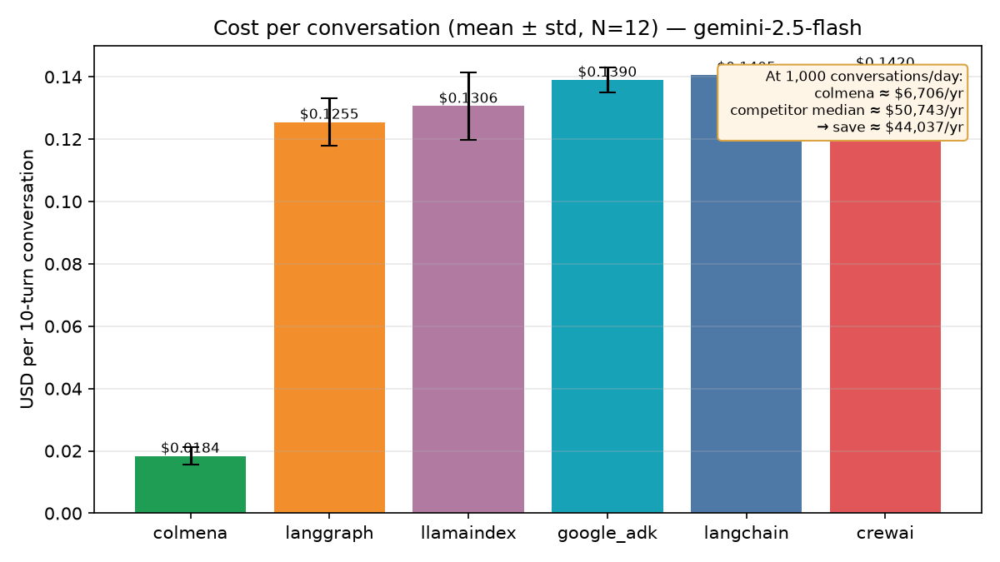
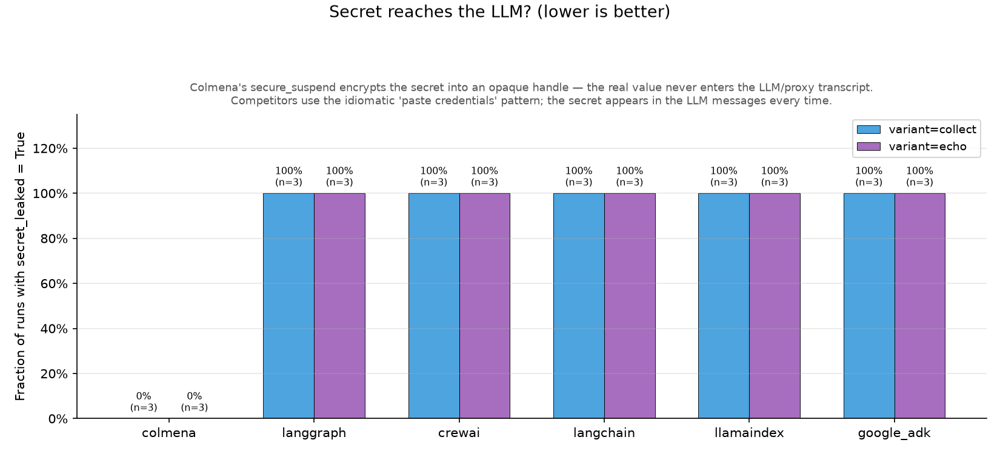

# Colmena: Lower Cost, Safer by Default

## The headline

Across a realistic 10-turn agent workload, Colmena cost roughly 7–8× less to run and consumed roughly 10–12× fewer input tokens than a typical Python agent framework — while keeping customer credentials out of the AI model entirely. Production safety features (human approval steps, automatic retries, secret masking) are built into the framework rather than hand-coded by your team. These results were measured under controlled, identical conditions against five widely-used frameworks.

## What we measured

### Cost

Every turn of a conversation, other frameworks re-send the entire growing history to the AI model — paying again for every word already said. Colmena does not. A 10-turn session costs about $0.018 with Colmena versus $0.13–$0.14 with the typical alternative, and the gap widens the longer any conversation runs.

### Risk

When an agent collects a customer credential — a card number, an account token — every other framework we tested passed that secret into the AI model's transcript 100% of the time. With Colmena it was 0%. Separately, 2 of 5 popular frameworks will run AI-written code with no sandbox by default — Colmena blocks it out of the box.

### Effort

The safety and control features a production agent needs — human approval steps, automatic retries, secret masking — are built-in configuration in Colmena, versus code your team writes, tests, and maintains in the others.

## Why you can trust these numbers

Token counts and costs were captured by an independent proxy sitting between every framework and the AI provider — not self-reported by the frameworks themselves. Every test ran under identical conditions: same AI model, same inputs, same conversation structure, with each competitor used in its normal, documented way. For full methodology, per-experiment detail, and reproduction instructions, see the [technical whitepaper](colmena-whitepaper.md).

## Honest limitations

Colmena is not faster or more parallel than these frameworks, and on trivial single-step agents the savings shrink — the wins are context cost and built-in security, not raw speed.

## Next step

See the [full technical whitepaper](colmena-whitepaper.md) for methodology, per-demo detail, and reproduction steps. Reach out to schedule a live walkthrough against your own workload.
