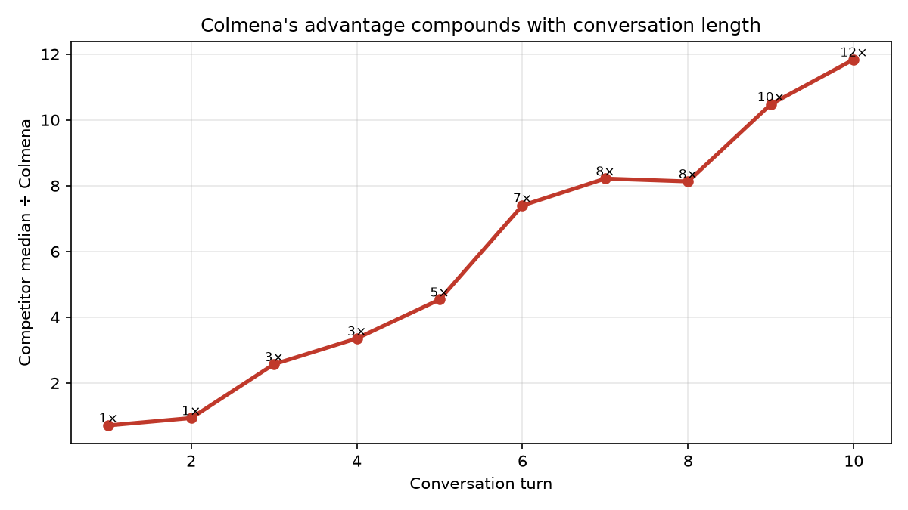
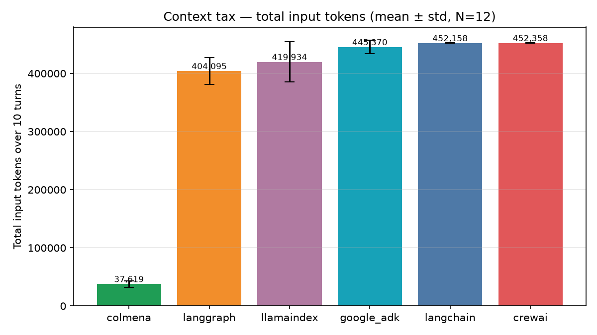
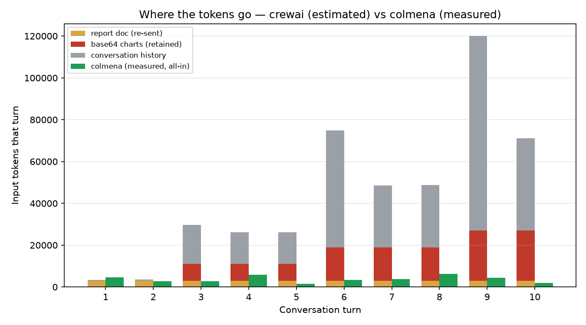
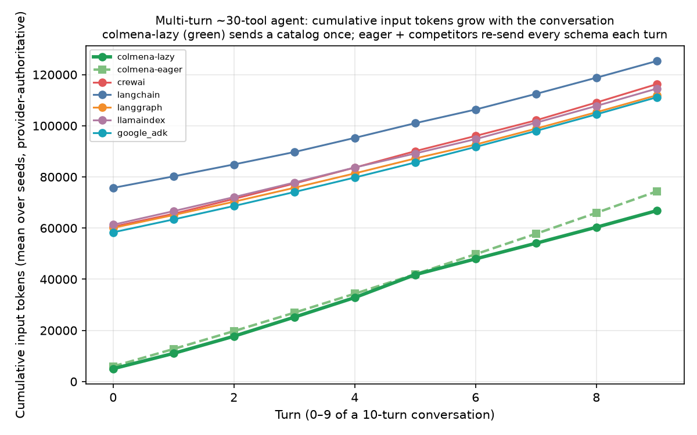
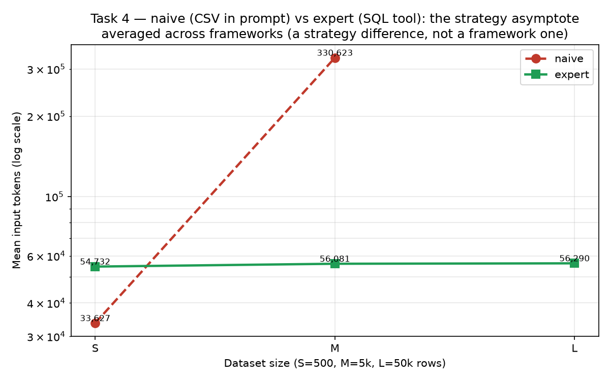
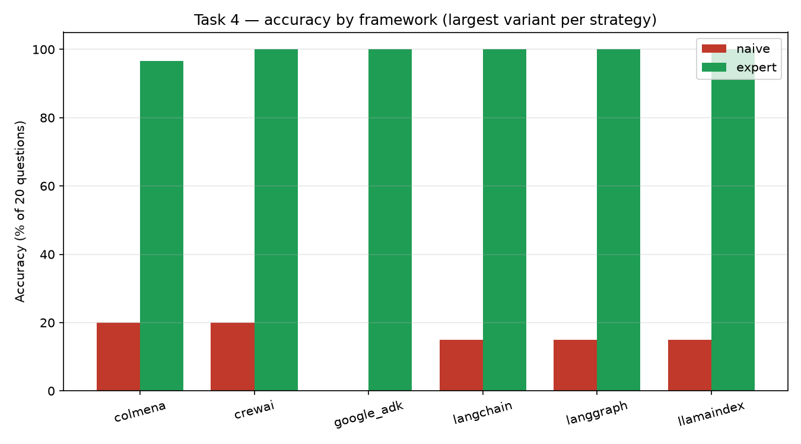

# A Provider-Authoritative Benchmark of LLM Agent Frameworks: Context Cost, Credential Isolation, and Agents as Configuration

**Colmena Engineering — Startti** · benchmark suite `colmena-bench` · July 2026

## Abstract

Multi-turn LLM agents accumulate conversation history, documents, and tool outputs, and most frameworks re-send that growing context to the model on every turn, so operating cost scales with conversation length while long contexts degrade answer quality. Production deployments face two further problems: hardening a prototype — approvals, retries, durable state, secret handling — absorbs most of the engineering effort, and a credential that enters a model's transcript propagates to every log and downstream system the conversation touches. We present a benchmark that measures how six agent frameworks — Colmena (Rust), CrewAI, LangChain, LangGraph, LlamaIndex, and Google ADK — handle these three problems under identical conditions, with all token and cost figures metered at a shared provider proxy rather than self-reported by the frameworks. Over a fixed 10-turn document-analysis session, Colmena consumed 39,085 input tokens versus 404,095–452,358 for the five Python frameworks — a 10–12× reduction ($0.018 versus $0.126–$0.142 per session) at equal task quality. In a credential-collection task, plaintext secrets reached the model transcript in 0% of Colmena runs versus 100% for every competitor. Colmena expresses production-safety controls as engine-enforced configuration, and its unit of authorship is a declarative JSON document executed by a generic server rather than a program that must be redeployed to change. The trade-offs are reported with the same rigor: Colmena is not faster per session and does not parallelize within a process — by design it scales by running many *distinct* agents as configuration on one engine rather than one agent at high per-process throughput — it holds no per-token price advantage, its history compaction trades up to ~7 percentage points of accuracy on large tabular recall, and two candidate experiments were dropped when a naive baseline matched Colmena's output quality.

## 1. Introduction

Three problems shape what an LLM agent costs to run in production — in money and in risk. This section develops each in turn; the experiments in §4–§9 measure how six frameworks handle them.

The first problem is the **cost of context**. An LLM is stateless between calls: everything an agent "remembers" — the conversation so far, the documents it has read, the output of every tool it has invoked — must be re-sent to the model as input tokens on every turn. Most agent frameworks therefore accumulate a growing message history and replay it verbatim, so the cost of turn *n* includes the cost of everything before it, and the price of a session grows superlinearly with its length; a single bulky artifact, such as a document pasted into the first message or a binary tool result, is paid for again on every subsequent turn. The same growth degrades quality: model accuracy falls when the relevant information sits in the middle of a long context ([Liu et al. 2023](https://arxiv.org/abs/2307.03172)), and practitioners now treat context as a finite resource with diminishing returns rather than a window to be filled ([Anthropic 2025](https://www.anthropic.com/engineering/effective-context-engineering-for-ai-agents)). An agent that manages its context naively therefore pays twice — once in dollars, once in answer quality — and the bill compounds with conversation length.

The second problem is **the distance between a prototype and a production agent**. A demonstration that works in a notebook lacks most of what production requires: approval gates before consequential actions, retries when the model returns a malformed or policy-violating answer, durable state so that an approval pending for hours survives a process restart, and control over what enters logs and transcripts. Autonomous agents are prone to compounding errors, and practitioners advise stripping back framework abstractions as a system moves toward production ([Anthropic 2024](https://www.anthropic.com/research/building-effective-agents)) — so this hardening is typically written by hand, per agent, by the engineering team. The authoring model compounds the burden: in mainstream frameworks an agent *is a program*, so every new agent — and every change to an existing one — is a code change that must be reviewed, built, and redeployed. As an organization's agent portfolio grows, its entire lifecycle sits inside the engineering deploy pipeline, and the hand-written safety code multiplies with it.

The third problem is **secure input**. Agents that act on a user's behalf routinely handle credentials and personal data — an API key to connect a service, a token pasted mid-conversation — and the naive pattern is to let those values flow through the model's context. Once a secret enters the transcript it propagates to every system the conversation touches: provider logs, observability tooling, stored histories, and any downstream consumer of the messages. OWASP ranks sensitive-information disclosure, security credentials explicitly included, among the top risks for LLM applications ([OWASP 2025](https://genai.owasp.org/llmrisk/llm022025-sensitive-information-disclosure/)), and vendor security guidance is unambiguous that credentials and connection strings should never be placed in a model's prompt ([Microsoft 2025](https://learn.microsoft.com/en-us/ai/playbook/technology-guidance/generative-ai/mlops-in-openai/security/security-plan-llm-application)). What that guidance does not supply is a mechanism: an agent that must *collect and use* a credential needs somewhere for the plaintext to live, and in the mainstream frameworks that somewhere is the message history itself.

This paper examines how six agent frameworks — Colmena (Rust) and five widely used Python frameworks (CrewAI, LangChain, LangGraph, LlamaIndex, and Google ADK) — handle these three problems under identical conditions. The comparison is provider-authoritative: every LLM call from every framework passes through one shared proxy, and all token and cost figures are read at that proxy rather than from framework self-reports. Colmena is the system under test because it takes an engine-level position on all three problems: context management (ephemeral attachments, history compaction, binary-result scrubbing, lazy tool loading) is a default rather than application code; production-safety controls (approvals, durable human-in-the-loop, critic-retry, secret masking) are engine-enforced configuration; and the agent itself is a declarative JSON document that a generic, already-running server executes, so agents are added, changed, or rolled back as data rather than redeployed as code.

The contributions are: (i) a reproducible, provider-authoritative benchmark harness covering six frameworks under identical model, temperature, and task conditions (§3); (ii) a measurement of the multi-turn context tax and its quality impact across all six frameworks (§4); (iii) a credential-isolation experiment with a binary transcript-leakage criterion (§5); (iv) a capability analysis of production hardening expressed as configuration rather than code, including its deployment consequences (§6); and (v) a limitations-and-negative-results account — code volume, speed, parallelism, per-token price, an accuracy trade-off, and two experiments dropped for null results — reported with the same rigor as the positive findings (§9).

The remainder of the paper is organized as follows. §2 reviews prior art on context-cost reduction and on declarative agent definition. §3 describes the methodology. §4–§8 present the five measured experiments. §9 reports limitations and negative results, and §10 concludes.

## 2. Related Work

The benchmark positions Colmena against prior art on the two axes it measures most directly: the context economy of multi-turn agents (§2.1) and the definition of agents as configuration rather than code (§2.2). The secure-input problem is grounded in the security guidance cited in §1 and is measured directly in §5.

### 2.1 The context tax, and the prior art for fighting it

In a multi-turn agent the conversation history, the documents it has read, and the result of every tool call accumulate, and most frameworks re-send that growing context to the model on every turn. Token cost therefore scales with conversation length rather than staying flat. The framework authors document this themselves: LangChain's context-engineering guide notes that long-running, tool-using agents accumulate large token counts that can exceed the context window and inflate cost and latency, and even degrade the agent's performance ([LangChain 2025](https://www.langchain.com/blog/context-engineering-for-agents)).

The degradation is not hypothetical. Liu et al. find that model accuracy drops sharply when the relevant information sits in the middle of a long context rather than at its edges ([Liu et al. 2023](https://arxiv.org/abs/2307.03172)) — an effect now widely called *context rot*, in which a model's ability to recall any given fact declines as the token count rises, so context is best treated as a finite resource with diminishing returns ([Anthropic 2025](https://www.anthropic.com/engineering/effective-context-engineering-for-ai-agents); [Chroma 2025](https://www.trychroma.com/research/context-rot)). Past a point, sending more context is not only more expensive — it makes the agent worse.

The field has produced several partial remedies, none of which is enabled by default in the five Python frameworks tested here (as configured in §4 and §8). Provider-side **prompt/context caching** discounts the cost of re-sending an unchanged prefix — Anthropic's prompt caching substantially reduces the processing time and cost of prompts that repeat a consistent prefix ([Anthropic n.d.](https://platform.claude.com/docs/en/build-with-claude/prompt-caching)), and Google offers an equivalent for Gemini ([Google n.d.](https://ai.google.dev/gemini-api/docs/caching)) — but it lowers the *price* of a large context, not its *size*. **Retrieval-augmented generation** retrieves only the passages relevant to a query at inference time, rather than placing an entire corpus in the model input ([Lewis et al. 2020](https://arxiv.org/abs/2005.11401)). **Conversation summarization** compresses older turns into a running summary ([LangChain 2025](https://www.langchain.com/blog/context-engineering-for-agents)), and OS-style memory architectures such as **MemGPT** page context in and out of a limited window ([Packer et al. 2023](https://arxiv.org/abs/2310.08560)). For tool-heavy agents, **dynamic tool loading** retrieves only the relevant tool schemas instead of injecting all of them every turn, cutting prompt tokens by more than half in one study ([Gan & Sun 2025](https://arxiv.org/abs/2505.03275)). Colmena's engine applies these same families of technique — ephemeral attachments, history compaction, binary-result scrubbing, lazy tool loading — by default; the Context Tax (§4) and Tools at Scale (§8) experiments quantify the difference against frameworks that do not.

### 2.2 Agents as code vs. agents as configuration

The second cost is structural rather than per-token. In the mainstream frameworks an **agent is a program**: its control flow, tools, and safety logic live in imperative code that imports the framework, so adding or changing an agent means editing code and redeploying the service — work only an engineer can do. A recent declarative-agent proposal frames the alternative directly: defining agents declaratively turns agent development into configuration, where adding a tool or adjusting an agent's behavior is a change to the pipeline specification rather than a code deployment ([Daunis 2025](https://arxiv.org/abs/2512.19769)). The same motivation drives Oracle's Open Agent Specification, which observes that the proliferation of agent frameworks has fragmented how agents are defined, executed, and evaluated, and proposes a representation that lets an agent be defined once and run across different runtimes ([Amini et al. 2025](https://arxiv.org/abs/2510.04173); see also the Auton framework's strict separation between a declarative agent blueprint and the runtime engine, [Cao et al. 2026](https://arxiv.org/abs/2602.23720)).

Configuration-defined agents predate this work. Cloud vendors already accept agent *configuration*: an Amazon Bedrock Agent is defined by instructions plus OpenAPI/function action-group schemas ([Amazon Web Services n.d.](https://docs.aws.amazon.com/bedrock/latest/userguide/agents-how.html)), and a Microsoft 365 Copilot declarative agent is a JSON manifest carrying the agent's instructions, knowledge, and actions ([Microsoft 2026](https://learn.microsoft.com/en-us/microsoft-365/copilot/extensibility/declarative-agent-manifest-1.5)). Framework-level config exists too — CrewAI presents YAML as its recommended way to define agents ([CrewAI n.d.](https://docs.crewai.com/en/concepts/agents)) — and visual builders such as Langflow serialize a flow to a JSON file a server runs ([Langflow n.d.](https://docs.langflow.org/concepts-flows-import)). What separates these approaches is *when* the configuration takes effect: a Bedrock Agent requires a build-time *prepare* step, a Copilot manifest ships inside an installed app package, and CrewAI YAML is still executed by your own Python harness. Colmena's specific position is that its native unit of authorship is a JSON DAG that a generic, already-running server interprets **from the request body** — no prepare, install, or redeploy — so one server serves many agents and a non-engineer can author, version, or roll one back as data. §6 develops this and is explicit about its boundaries: it is an operating-model difference, not a benchmark number, and a configuration layer could be built over any of the competitors — that layer is simply what Colmena already ships.

## 3. Methodology

**Design rationale.** Agent-framework comparisons are usually published by the framework's own authors, who control what gets measured, how tokens are counted, and which baselines are included. This benchmark is designed so that its central quantities do not depend on any framework's self-reporting: all token and cost numbers are captured at a shared LiteLLM proxy that sits between every framework and the model provider. The proxy is the single authoritative source, so a framework that under-counts its context in its own SDK logs cannot inflate its apparent efficiency.

**Frameworks under test.** The benchmark covers six frameworks: Colmena (Rust), CrewAI, LangChain, LangGraph, LlamaIndex, and Google ADK (all Python). Each framework implements the same agent task independently, using its native idioms. Each competitor framework was used idiomatically — its own default memory management, context-window strategy, and tool-calling conventions — and none was configured toward a suboptimal pattern.

**Baseline calibration.** A trivial single-tool-call task ("hello world", N=10 per framework) calibrates each framework's fixed per-call overhead before the multi-turn experiments. All six frameworks succeed at 100%, with per-call input tokens of 14–15 for Colmena, LangChain, LangGraph, and LlamaIndex versus 35 for Google ADK and 77 for CrewAI — a fixed scaffolding cost those two frameworks pay on every call — and per-call median latency at parity (Colmena 761 ms, LangChain 738 ms), which locates Colmena's session-level call-count overhead (§9.2) in its extra round-trips rather than in per-call speed. (Single-call latency is measured by each runner directly and is unaffected by the serial-sweep constraint that precludes session-level wall-clock comparison for Colmena.) These calibration runs used an earlier Colmena build (0.3.0) than the one pinned in Appendix C and are reported for calibration only.

**Token authority: the LiteLLM proxy.** All LLM calls are routed through a local LiteLLM proxy configured with a single model alias. Proxy spans are written to per-session JSON files. For Python frameworks, each run attaches an `x-bench-run-id` header, which the proxy propagates into the span metadata; token counts for that run are read directly from the spans tagged with that ID.

**Colmena token measurement.** Colmena cannot inject the `x-bench-run-id` header via its current HTTP client, so its proxy spans land in the session file without a run tag. Token counts for Colmena are measured by taking a **line-count delta** of the session file immediately before and after each run. To keep this delta attributable to exactly one run, all Colmena experiments execute as a **serial sweep** — one run at a time, with no concurrent activity on the proxy. Because no other traffic touches the session file during a run, the delta contains exactly that run's spans, so the constraint affects scheduling, not the accuracy of any individual count; its one measurable consequence is that wall-clock latency comparisons are unavailable for Colmena (§9.2).

**Model and conditions.** Every run executes under identical conditions: all frameworks use the alias `gemini-2.5-flash` (resolved at the proxy to `gemini/gemini-2.5-flash` on Google AI) at temperature 0, against the same proxy endpoint, the same task inputs, and the same evaluation scripts, with framework versions pinned (Appendix C). The per-token price is identical across all frameworks; the measured variable is how much context each framework sends, not what it costs per token.

**Quality evaluation.** Each experiment carries a quality metric fixed before the runs, so token savings cannot be traded silently for degraded answers. The Context Tax scores answers with a ground-truth substring check on three designated turns (with a complementary LLM-judge score reported in Appendix A.1); Tools at Scale scores tool-selection accuracy against the known correct tool; Sandboxed Code Execution and the Query-Strategy Trade-off (reported in §9.4) score analytical answers against a precomputed ground truth over a synthetic dataset; Credential Isolation uses the binary transcript-leak criterion defined in §5.3; and Production Hardening as Configuration uses an all-capabilities pass criterion (correct refund decision, durable HITL resume, critic evaluation, no secret in the transcript).

**Replication.** Sample sizes vary by experiment based on the variance of the metric. The Context Tax runs N=12 per framework, reported as mean ± std; Credential Isolation runs n=3 per cell across 12 cells (6 frameworks × 2 variants), 36 runs in total; Tools at Scale uses 5 seeds per framework for the multi-turn experiment, with the single-turn 200-tool probe (§8.2) at n=2 trials per configuration; and the Query-Strategy Trade-off is swept across dataset sizes to characterize the token-scaling curve. Full version pins, environment setup, and per-experiment run scripts are in Appendices C and D.


## 4. The Context Tax

### 4.1 Scenario

The benchmark runs a fixed 10-turn conversation against a "report analyst" agent. Each framework receives the same synthetic Q3-2026 report (~12,000 characters), the same deterministic `generate_chart` tool (which returns a fixed base64 PNG of roughly 32 KB), and the same sequence of 10 user messages: four document-retrieval questions, three chart-generation requests, and three follow-up turns. The task is modeled on a common enterprise workflow — iterative document Q&A with binary tool outputs — and it is identical for all six frameworks. No framework received tuning hints or custom memory configuration; each ran with its own default context-management behavior.

### 4.2 Results


*Figure 1: Colmena's cumulative input tokens remain nearly flat across all 10 turns while each of the five Python frameworks grows roughly linearly, reaching 404,095–452,358 tokens by turn 10.*

Aggregate results are reported as mean ± std over N=12 runs in Table 1.

| Framework | Total input tokens (mean ± std) | Turn-10 tokens | Cost (10 turns) |
|---|--:|--:|--:|
| **Colmena** | **39,085 ± 9,326** | **2,296** | **$0.018** |
| LangGraph | 404,095 ± 23,121 | 71,181 | $0.1255 |
| LlamaIndex | 419,934 ± 34,873 | 71,225 | $0.1306 |
| Google ADK | 445,370 ± 11,614 | 71,395 | $0.1390 |
| LangChain | 452,158 ± 456 | 71,144 | $0.1405 |
| CrewAI | 452,358 ± 285 | 71,202 | $0.1420 |

*Table 1: The Context Tax — total input tokens, turn-10 input tokens, and session cost per framework (mean ± std, N=12).*

Three quantities summarize the result. Over the full 10-turn conversation Colmena sends **~10–12× fewer total input tokens** (39,085 vs the competitor range 404,095–452,358; Figures 1 and 3), and the gap widens with each turn — by turn 10 alone it is **~31× fewer** (2,296 vs 71,144–71,395; Figure 2). That translates to **~7–8× lower cost** ($0.018 vs $0.1255–$0.1420), a function of context volume rather than price-per-token, since the per-token price is identical across all frameworks (Figure 4; §9.3).

Colmena shows the largest relative variability (std ±9,326, ≈24% of its mean), which reflects the model's per-turn decision of whether to re-read the document via `load_attachment` — a property of the mechanism rather than measurement noise. Competitor variability is at most 8.3% of the mean (std ±285 to ±34,873).



*Figure 2: The efficiency multiplier grows with each turn as competitor histories accumulate; by turn 10 Colmena uses roughly 31× fewer tokens than the next-best competitor.*



*Figure 3: Total input tokens per framework (10-turn sum): Colmena is an order of magnitude below every competitor.*


*Figure 4: At $0.018 for a full 10-turn session, Colmena's cost is 7–8× lower than competitors (about 7× vs the cheapest, LangGraph) — entirely from context volume, not a price-per-token advantage.*

### 4.3 No quality cost

A context-efficiency result only matters if the agent still answers correctly. The guardrail scores each framework's answers on three designated document turns — the key-findings summary (turn 0), the highest-revenue region (turn 1), and the top risks (turn 7) — with chart turns excluded by design; a complementary LLM-judge score covers the remaining turns (Figure 5; Appendix A.1).


*Figure 5: Answer quality is roughly equal across all six frameworks; Colmena does not trade accuracy for token efficiency.*

Colmena's document-turn answers are correct: turn 1 returns "North America," turn 7 returns "Supply chain," and the turn-0 summary describes the quarter's trend as positive. The quality result addresses the natural objection: the token reduction does not come at the cost of answer quality.

### 4.4 Why it works: ephemeral attachments and the binary scrubber

The near-flat token curve has two distinct causes, both visible in the token composition breakdown (Figure 6).



*Figure 6: History tokens (the growing colored bars) dominate competitor totals; Colmena's history is small because attachments are never pinned and binary tool results are scrubbed before they enter the context.*

**Mechanism A — ephemeral attachments.** The Q3-2026 report (~3,000 tokens) is loaded via Colmena's `load_attachment` primitive. The attachment is read on the turns that need it and is explicitly *not* pinned into the conversation history. Competitors append the report to the first user message and re-send it in every subsequent turn as part of the standard message history.

**Mechanism B — binary tool-result scrubber.** Colmena's `dag_tool_executor` applies `scrub_tool_result_output` before any tool result reaches the LLM or is written into history. The ~32 KB base64 chart PNG (~8,000 tokens) is elided at the framework layer. All five Python competitors retain the raw tool message in history by default; after the first `generate_chart` call, that base64 blob re-enters the context on every subsequent turn.

Neither mechanism requires any application-level code from the developer. Both are active by default in Colmena's engine. The imperative Python a developer writes for the Context Tax is 53 lines; the agent itself is a ~71-line declarative JSON DAG.

To match Colmena's token behavior, a Python framework developer would need to write custom history-trimming logic, an attachment-caching layer, and a binary-elision pass — none of which are provided out of the box by any of the five competitors tested.

### 4.5 Call-count overhead

Colmena's token advantage holds *despite* more model round-trips, not fewer — each `load_attachment` is an extra LLM call, which counts against Colmena on both latency and call count, yet the ~10–12× token reduction remains. That trade-off (and the wall-clock caveat) is quantified in §9.2.

## 5. Credential Isolation

### 5.1 Scenario

Many real-world agents must collect sensitive credentials mid-conversation — API keys, OAuth tokens, passwords — and forward them to a downstream service. The naive pattern is to ask the user to paste the credential into the chat, which places the plaintext into the model's message history, into any proxy or observability layer, and into every log that touches the conversation. This experiment tests whether a framework can collect and use credentials without the plaintext ever entering the LLM transcript.

### 5.2 Test variants

The benchmark runs two complementary variants to probe both collection and echo paths.

**`collect` variant.** The agent asks the user for credentials; the user pastes them. In Colmena, the `secure_suspend` primitive intercepts each credential at collection time, encrypts it (AES, keyed by the engine's `SECURE_VALUES_KEY`), and returns an opaque handle of the form `<sv_*>` to the model. The plaintext never appears in the LLM message history. When the downstream API call is made, Colmena's executor resolves the handle and injects the real value into the HTTP request automatically. Every competitor places the pasted credential directly into the message history — the secret is visible in the transcript from the moment the user sends it.

**`echo` variant.** A downstream tool echoes the secret back in its response (simulating a misconfigured service that returns credentials in its reply). Colmena's `dag_tool_executor` applies a re-masking pass before the tool result re-enters the model context, replacing the plaintext with the opaque handle. For the competitors this variant cannot change the outcome — the secret has already appeared in the transcript during `collect` — but it confirms that Colmena's masking holds even when a tool actively returns the value.

### 5.3 Leak-rate results

"Leak" is defined as: the plaintext secret appears anywhere in the LLM-visible transcript (user message, assistant message, or tool result). Lower is better. Table 2 and Figure 7 report the leak rate per cell.

| Framework  | variant=collect | variant=echo |
|------------|-----------------|--------------|
| **colmena**| **0%** (0/3)    | **0%** (0/3) |
| langgraph  | 100% (3/3)      | 100% (3/3)   |
| crewai     | 100% (3/3)      | 100% (3/3)   |
| langchain  | 100% (3/3)      | 100% (3/3)   |
| llamaindex | 100% (3/3)      | 100% (3/3)   |
| google_adk | 100% (3/3)      | 100% (3/3)   |

*Table 2: Leak rate by framework and variant (n=3 per cell).*


*Figure 7: Fraction of runs in which the plaintext secret entered the model-visible transcript (n=3 per cell). Colmena: 0% in both variants; all five competitors: 100% in both.*

Results span 36 runs across 12 cells (6 frameworks × 2 variants, n=3 per cell) with 0 errors. The outcome is binary — either the plaintext appears in the transcript or it does not — and is unambiguous across all runs.

### 5.4 Mechanism analysis

The result follows directly from capabilities that Colmena provides at the engine layer and that every competitor must implement by hand (Table 3):

| Capability | Colmena | Competitors |
|---|---|---|
| Encrypted collection (AES) | ✓ native (`secure_suspend`) | ✗ hand-rolled |
| Opaque handle to the LLM (`<sv_*>`) | ✓ | ✗ (plaintext in history) |
| Auto-inject real value into the downstream call | ✓ | ✗ manual |
| Re-mask if a tool echoes the secret | ✓ | ✗ |

*Table 3: Engine-layer capabilities relevant to credential isolation.*

None of these capabilities require application-level code from the developer; they are active by default in Colmena's execution engine.

### 5.5 Limitations

**Scale.** This is a capability/counterfactual benchmark at modest scale (12 cells, n=3 per cell, 36 runs total). It is not a large statistical sweep. Because the result is a hard binary — plaintext present or absent — scale does not change the conclusion, but readers should treat it as a proof-of-capability demonstration rather than a high-powered significance study.

**Functional equivalence.** `delivered_to_api = true` for all Colmena runs: the real secret is correctly injected into the downstream HTTP call in every case, so the zero-leak result is not achieved by refusing to perform the task. All six frameworks complete the task correctly; the measured difference is solely whether the plaintext enters the LLM transcript in the process.

**LangGraph nuance.** LangGraph has a genuine durable human-in-the-loop primitive (`interrupt()`) that Colmena's `secure_suspend` conceptually resembles. The distinction is scope: keeping the secret out of the persisted state, encrypting it, auto-injecting it into downstream calls, and re-masking tool echoes are all still hand-rolled in LangGraph. Colmena makes the entire chain the default, not an exercise left to the developer.

## 6. Production Hardening as Configuration

### 6.1 The claim

Taking a refund-decision agent from prototype to production requires at least four capabilities beyond a working LLM call: a **graph control flow** to express branching logic cleanly, **durable human-in-the-loop (HITL) suspend/resume** so an approval step survives process restarts, a **critic-retry loop** that catches bad outputs before they leave the agent, and **outbound secret masking** so credentials injected into tool calls never appear in logs, transcripts, or LLM contexts.

All six frameworks can implement all four capabilities. The question this experiment tests is not *can you build it* but *where does the capability live*: in engine-enforced declarative config that is always on, or in imperative code that a developer writes, tests, ships — and can forget to write.

The claim is limited to that question. This is not a lines-of-code comparison, and it is not a claim that only Colmena has graph control flow — LangGraph and Google ADK are graph-first frameworks. The differentiator is the *mode of expression* and what happens when that expression is absent.

### 6.2 Capability matrix

Table 4 classifies each capability, per framework, as engine-native or developer-implemented (DIY) at the pinned versions.

| Capability | colmena | langgraph | crewai | langchain | llamaindex | google_adk |
|---|---|---|---|---|---|---|
| Graph control flow | native | native | DIY | DIY | DIY | DIY |
| Durable HITL | native | native | DIY | DIY | DIY | DIY |
| Critic-retry loop | native | native | DIY | DIY | DIY | DIY |
| Outbound secret masking | native | **DIY** | DIY | DIY | DIY | DIY |

*Table 4: Capability provision by framework at the pinned versions — native versus developer-implemented (DIY).*

LangGraph is the closest peer: it provides native graph control flow, durable HITL, and a critic-retry loop, matching Colmena on three of four capabilities — the single differentiator is outbound masking, the one cell where every framework other than Colmena requires hand-written code.

### 6.3 Masking counterfactual

Credential Isolation (§5) is the dedicated, measured secret-handling result; this section adds only what is specific to a hardened production agent — the *config-vs-code* counterfactual. It contrasts safety enforced by construction with safety that depends on the developer remembering the safeguard: the same agent implemented twice, once with the scrubbing code included (hardened) and once with it omitted (naive) — Table 5.

| Variant | colmena | 5 Python competitors |
|---|---|---|
| Hardened (scrub written) | safe | safe |
| Naive (scrub omitted) | **safe** — engine `secure:true`, cannot be omitted | **leaks** |

*Table 5: Masking counterfactual — the same agent with the safeguard included (hardened) and omitted (naive).*

Every hardened implementation passes: the correct refund decision is returned, no secret appears in the outbound transcript, HITL suspend/resume works, and the critic gate evaluates every draft across all six frameworks (run records in `runs/demo06/`; the naive-variant leak is reproduced by the replication guide, `docs/demos/demo06-replication.md`). The durability of the HITL step is exercised substantively: phase one collects the approval request and the process exits, and a *fresh* process resumes from the persisted state (`phase1.json` → `.state` → `phase2.json` per framework) — surviving a process restart is the substantive test of durability. The leak is a demonstrated counterfactual of the *naive* variant, not a measured failure of any hardened implementation — in the Python frameworks the omission is a realistic developer mistake, while in Colmena `secure: true` is a field on the node definition that the engine enforces unconditionally.

Two disclosures bound this result. First, in all recorded hardened runs the draft decision already satisfied the policy, so while the critic evaluated every draft (`critic_ok = true`), the retry path itself was never triggered (`retries = 0` across all six frameworks); exercising it under a forced policy violation is noted as future work (§10). Second, Colmena's re-masking protects values that re-enter the LLM **as a `secure: true` tool result** — a secure handle wired directly into an `llm_call` prompt via a plain DAG edge is decrypted at injection time and would leak. The refund agent therefore models the payment as a `secure: true` tool inside the confirmation step. The guarantee is real but specific to the tool-result path; it is not a blanket claim that every value is masked everywhere.

### 6.4 Code volume

For the refund agent specifically, Colmena's hardened implementation is the *longest* of the six (235 lines total; the full per-framework table is in Appendix A.2, discussed in §9.1). LOC is not a Colmena advantage. The point of *this* section is not character count but that the four capabilities above are expressed as engine-enforced config rather than imperative logic a reviewer must trace.

### 6.5 Configuration, not code — one server, many agents

The "mode of expression" difference has a deployment consequence that is not a measured number but is structural, and it is the clearest architectural distinction in this comparison. In the five Python frameworks an agent **is a program**: the refund agent ships as `runners/<framework>/runner/tasks/task06_refund.py` — imperative Python that imports the framework, constructs tools, and wires control flow in code. In Colmena the same agent **is a document**: `runners/colmena/runner/dags/refund_agent.json` — a declarative graph that a generic engine interprets at run time.

A side-by-side comparison of the two artifacts shows a difference in *kind*, not size: one is code that is compiled and deployed, the other is data handed to a running server.

That changes the operating model. Colmena's production deployment — the agent-deployment platform (ADP) in which this engine runs — is a generic server that accepts the graph **in the request body** — `POST /api/v1/executions` with a `dag_json` field — and a worker fleet that executes whatever graph it is handed. The consequence is twofold. One running server serves many different agents: adding or changing an agent means handing the server a different document, with no code change, rebuild, or redeploy of the service. And because the agent is data, it can be versioned, rolled back, or A/B-tested as such, and authored or modified by an upstream system or a non-engineer working against a schema — not only by an engineer through a CI/CD pipeline.

In a library-based framework, by contrast, the agent's logic lives in code, so a new or changed agent is a code change that must be shipped through a deploy. This is a property of how those frameworks are designed — the agent is authored in their API — not a deficiency of any one of them.

**Scope and limitations of this claim.** (1) This is an architecture and operating-model difference, not a benchmarked metric — there is no proxy number behind it. (2) It is **not** a lines-of-code advantage; declarative config and imperative code are not comparable by length. (3) LangGraph offers a hosted deployment service (LangGraph Platform, since renamed LangSmith Deployment; [LangChain n.d.](https://www.langchain.com/langgraph-platform)) that runs graphs in production, but those graphs are defined in Python and shipped as code — a build-and-deploy cycle, not a configuration interpreted at request time. (4) A team could build a JSON-interpreter layer over any Python framework to get the same property — but that interpreter is precisely what Colmena already is. The claim is "Colmena's native unit of authorship is configuration, and it ships the runtime that executes it," not "this is impossible elsewhere."

## 7. Sandboxed Code Execution

### 7.1 Scenario

The agent receives a CSV and is asked to run analytical code against it — summary statistics, filtering, derived columns. To probe containment, the harness simultaneously plants a canary file at a known path and instructs the model to read it as part of its tool call. A framework that executes model-written code without restriction will expose the canary; a framework that sandboxes execution will suppress the read and return a containment signal instead.

### 7.2 Canary-probe results

Table 6 reports the probe outcome and containment mechanism per framework.

| Framework | Canary read? | Containment mechanism |
|---|---|---|
| **Colmena** | **Contained** | Restricted in-process AST sandbox — import allowlist, banned builtins, no filesystem or network access — declared once as a native tool, no external service |
| LlamaIndex | Contained | Library `safe_eval` excludes `open` and other dangerous builtins |
| CrewAI | Contained | Docker container (OS-level isolation) |
| Google ADK | Contained | Server-side kernel sandbox |
| LangChain | **Leaked** | Raw `PythonAstREPLTool` executes arbitrary Python with no sandbox |
| LangGraph | **Leaked** | Raw `exec` tool — no restrictions |

*Table 6: Canary-probe outcome and containment mechanism by framework.*

### 7.3 Interpretation

Colmena is not the only framework that contained the probe — three competitors also did, by different means. The useful signal is narrower: **two widely used frameworks (LangChain and LangGraph) execute model-written code with no sandbox by default**. That is a reproducible risk for any deployment that exposes a code-execution tool to a model without an explicit sandboxing decision.

Colmena's specific contribution is that containment is **declarative and in-process**: one native tool configured with a `restricted` mode, no Docker daemon to manage, no separate kernel service to provision or pay for. There is no wiring step that can be omitted by the application developer, and the policy is visible in the agent's JSON configuration rather than buried in a code path.

That said, **CrewAI's Docker container offers stronger isolation than an in-process AST allowlist** — an AST-level bypass that evades the allowlist would still be contained at the OS boundary by Docker. Colmena's advantage is containment by default with nothing to wire, not the strongest possible sandbox. Deployments with high-assurance requirements should evaluate whether OS-level isolation is warranted regardless of orchestration framework.

### 7.4 Analytical accuracy

Where the analytical results were measured, accuracy is roughly at parity. Reported as the per-framework mean across measured variants: Colmena 0.975 (M=0.95, L=1.0; the S variant was not measured in this run), LlamaIndex 0.97, LangChain 0.95. The lower per-framework means for LangGraph, Google ADK, and CrewAI (0.55–0.68) trace to transient empty model completions on individual variants — CrewAI in particular swings from 0.95 (S) to 0.15 (M) — not to any framework capability difference. Analytical accuracy therefore shows no advantage for Colmena; the full cross-experiment accuracy picture is in §9.

## 8. Tools at Scale

### 8.1 Scenario

Real enterprise agents often expose large tool catalogs — dozens to hundreds of callable functions covering different data sources, APIs, and actions. Each Python framework tested here sends the full JSON schema for every tool in the catalog on every LLM turn. As the catalog grows and the conversation extends, that cost compounds: the per-turn schema payload is proportional to catalog size, and because verbatim history also accumulates, cumulative session tokens grow superlinearly with turn count. Colmena's `lazy_tool_loading` changes the default: the engine sends the model a compact catalog (names and one-line summaries) and fetches a tool's full schema only when the model signals intent to call it. A second, independent mechanism — conversation-memory compaction — trims the growing message history by replacing earlier turns with a compressed summary. This experiment isolates the contribution of each mechanism.

### 8.2 Single-turn isolation: lazy loading alone

Because a single-turn probe has no accumulated conversation history, any gap here is attributable entirely to the lazy-loading mechanism, not to compaction. The probe runs the same task (tool selection from a catalog of varying size) at catalog sizes of 5, 50, and 200 tools (Figure 8), with no prior turns in the session (n=2 trials per configuration; the metric is a near-deterministic schema-byte count, so the small sample is sufficient to characterize the gap).


*Figure 8: At 200 tools, colmena-lazy uses 22,190 input tokens versus 44,722–103,539 for competitors (2.0–4.7×); colmena-eager sits in the competitor range, confirming the gap is the lazy-loading mechanism, not any other Colmena property.*

The **colmena-eager** configuration serves as the control. When lazy loading is disabled and Colmena sends every schema in full — exactly as competitors do — its token count falls within the competitor range. The roughly 2.3-fold spread among competitors at 200 tools — four frameworks clustered near 44.7k tokens with CrewAI at 103.5k — reflects how verbose each framework's default schema serialization is, not a correctness difference. Colmena-lazy separates from all of them because the schemas for tools the model never touches in that turn are simply not sent. The gap grows with tool count because each additional unused schema is a constant per-tool overhead that lazy loading avoids entirely; the relationship is log-linear as plotted.

### 8.3 Multi-turn result: lazy loading + compaction together

Over a 10-turn session with a 30-tool catalog, both mechanisms are in play. Cumulative input tokens at the final turn are shown in Table 7 and Figure 9.

| Framework | Cumulative input tokens (turn 10) |
|---|--:|
| **colmena-lazy** | **66,808** |
| colmena-eager | 74,337 |
| Google ADK | 111,135 |
| LangGraph | 111,922 |
| LlamaIndex | 114,515 |
| CrewAI | 116,264 |
| LangChain | 125,305 |

*Table 7: Cumulative input tokens at turn 10, 30-tool catalog (mean over 5 seeds).*



*Figure 9: Colmena-lazy accumulates 66,808 tokens over 10 turns versus 111,135–125,305 for competitors (1.66–1.88×), at identical tool-selection accuracy (1.00) across all configurations and all turns.*

### 8.4 Attribution of the multi-turn result

The 1.66–1.88× multi-turn advantage requires disaggregation, because most of it does **not** come from lazy loading.

In the multi-turn setting, Colmena's conversation-memory compaction is active for both colmena-lazy and colmena-eager. Both configurations compress growing history; both hold a large cost advantage over the five Python competitors, which accumulate history verbatim. That shared compaction benefit is what produces the majority of the ~1.5–1.7× advantage that colmena-eager already shows over competitors without lazy loading doing any additional work.

The lazy-loading increment over eager is modest at 30 tools: 74,337 (eager) vs 66,808 (lazy), approximately **1.11×**. That increment grows as tool count increases — which is what the single-turn probe in §8.2 isolates. At 200 tools on a single turn, lazy loading produces a 2.0–4.7× advantage over competitors on its own; the multi-turn experiment uses 30 tools, so the lazy-specific contribution is smaller.

In summary: **compaction drives the multi-turn result; lazy loading is the isolated differentiator in high-tool-count regimes and grows in value as catalogs scale.** Both are active by default — a Python framework developer who wanted comparable behavior would need to implement a history-compaction strategy and a schema-dispatch layer independently.

### 8.5 No accuracy cost

Tool-selection accuracy is 1.00 at the final session turn across all six frameworks, and 1.00 on the 200-tool single-turn probe for all configurations including colmena-lazy. The advantage is cost, not accuracy. The full cross-experiment accuracy picture, including where Colmena does and does not have an advantage, is in §9.

## 9. Limitations and Negative Results

This section documents every result where Colmena shows no advantage, every experiment that was built and then dropped for a null result, and every trade-off that accompanies a measured advantage. Two kinds of entry appear below, kept separate throughout: genuine losses on a like-for-like comparison — code volume, wall-clock speed, per-token price — and places where the comparison itself is not like-for-like, which are identified as such (the clearest case is concurrency, §9.2, where the single-agent measurement does not address the question that dominates at scale).

### 9.1 Code volume


*Figure 10: Maintained-code comparison: Colmena is not categorically shorter.*

In the Context Tax, the maintained Python wrapper is 53 lines, but the agent is also described as a ~71-line declarative JSON DAG — the real authored artifact includes both (Figure 10). In Production Hardening as Configuration the production agent is 120 lines of code plus 115 lines of declarative config (235 lines total) against competitor totals of 93–171 lines. Colmena's 235-line total is the highest of all six; counting only imperative code, its 120 lines trail only LangGraph's 171 and exceed the other four Python frameworks.

Colmena is **not** categorically fewer lines. The defensible statement is narrower — least *imperative* code to maintain, plus guarantees the engine enforces — and even that weakens on trivial agents: a single-step agent with no memory requirements, no HITL, and no secret handling can be written more concisely in any of the Python frameworks than in Colmena's DAG format. The comparison becomes meaningful only when the capabilities of §5 and §6 are required; at that point the relevant question shifts from how many lines are written to which lines are enforced. Raw line count is not a favorable comparison for Colmena, and we do not present it as one.

### 9.2 Speed and parallelism


*Figure 11: LLM-call count: Colmena makes more round-trips, not fewer.*

**The like-for-like loss.** Colmena is not faster. It makes approximately **18 LLM calls** over the 10-turn Context Tax session versus **13 for competitors** (Figure 11), because each `load_attachment` invocation is a separate model round-trip; the extra calls add latency. (The harness cannot report reliable wall-clock figures for Colmena because its runs are serialized for token attribution; see §3.) Its execution engine is also a **sequential worklist**: even nominally parallelizable tasks are awaited in a loop, with no concurrent fan-out. A workload that requires parallel fan-out — many simultaneous tool calls, a scatter-gather over dozens of APIs, a map-reduce over independent subtasks — is better served by a Python framework with native async execution.

**Where the comparison is not like-for-like.** A concurrency load-test (the Concurrency Ceiling, `docs/demos/demo13-concurrency.md`) gives the direct measurement (Table 8): under a fixed-latency LLM mock, Colmena's single-process embedded `serve` mode plateaued at ~2.6 requests/sec from 4 concurrent clients onward, with p95 latency growing from 1.3 s to 19.4 s and 22 requests timing out at 64 clients, while a single async LangGraph server scaled approximately linearly to ~50 requests/sec with flat latency.

| Clients | Colmena rps | Colmena p95 | LangGraph rps | LangGraph p95 |
|--:|--:|--:|--:|--:|
| 1 | 0.9 | 1.29 s | 0.8 | 1.22 s |
| 2 | 1.6 | 1.32 s | 1.6 | 1.23 s |
| 4 | 2.6 | 1.63 s | 3.2 | 1.24 s |
| 8 | 2.6 | 3.09 s | 6.5 | 1.25 s |
| 16 | 2.6 | 6.09 s | 12.9 | 1.27 s |
| 32 | 2.6 | 11.98 s | 25.6 | 1.30 s |
| 64 | 2.5 (+22 timeouts) | 19.41 s | 50.4 | 1.44 s |

*Table 8: Concurrency load-test under a fixed-latency LLM mock, single process per side (data: `runs/demo13/phase1/`). Marginal memory per additional session at 64 clients: Colmena ~0.58 MB versus LangGraph ~0.16 MB.*

What Table 8 measures, however, is the throughput of **one agent under concurrent requests** on the embedded single-process binary — which is neither how Colmena is deployed in production nor the axis that dominates at scale.

The production-relevant axis is not one agent at N requests but **N distinct agents**, and on that axis the operating models differ in kind, as §6.5 develops: a Colmena agent is a document handed to an already-running engine — the benchmark itself ran every Colmena experiment in this paper on a single engine build by swapping the DAG, never recompiling — whereas in the five Python frameworks each agent is a program, so a fleet of distinct agents means a deployment per agent or a multi-tenant dispatch layer the team builds itself. We did not benchmark this multi-agent axis and therefore attach no number and claim no advantage — but per-process throughput of one agent and the operating cost of a fleet of *different* agents are separate quantities, and a conclusion about the second cannot be read off a measurement of the first.

Both statements hold simultaneously and should be kept apart: on per-process throughput and raw parallelism Colmena loses the like-for-like comparison (a single high-QPS agent is better served by a Python async server); on the many-distinct-agents operating model the relevant property is the configuration-driven engine of §6, which is an architecture difference, not a benchmarked throughput result. The load-test's one memory observation — a Colmena instance at ~28–65 MB RSS versus ~122–132 MB for the Python server — is where the small per-instance footprint would matter in that fleet-of-workers shape, although Colmena's *marginal* RAM per additional session is higher.

### 9.3 No per-token price advantage

Every framework in this benchmark calls the same model (`gemini-2.5-flash`) through the same proxy at the same per-token price. There is no Colmena pricing tier, no batching discount, and no model substitution in play. All cost differences reported in §4 and §8 are entirely a function of how much context each framework sends — Colmena's advantage comes from sending less, never from paying less per token. A team that already manages context size carefully in a Python framework will not see a pricing-line improvement from switching.

### 9.4 The Query-Strategy Trade-off



*Figure 12: Expert/SQL strategy keeps input tokens flat as the dataset grows while naive/raw-CSV grows linearly — a strategy result, not a Colmena-specific one.*



*Figure 13: Accuracy by framework at the largest dataset size: Colmena expert reaches ~96.7%; competitors cluster near 100%.*

The Query-Strategy Trade-off is primarily a **strategy** result: querying a CSV via a SQL tool ("expert") beats stuffing raw rows into the prompt ("naive") by approximately 5–9× on tokens and 4–7× on accuracy. Expert input tokens stay roughly flat as the dataset grows (Colmena ~76k→79k across S/M/L) while the naive approach grows linearly with dataset size (~34k at S → ~331k at M; not run at L; Figure 12); across frameworks expert input ranges ~36k–79k. Any framework using the expert/SQL strategy gets most of this benefit.

The trade-off: **Colmena's expert accuracy is 93–97% (S=96.7%, M=93.3%, L=96.7%) versus competitors' 96.7–100%, with most competitor cells at or near 100% (Figure 13).** Against that norm the residual gap of roughly 3–7 percentage points is real and reproducible. Its cause is the same rolling-summary context compaction that produces the Context Tax token reduction: the compaction pass can truncate a large mid-conversation tool-result table before the final answer is assembled. (An earlier engine build scored 88–92% on this task; the build pinned in Appendix C narrows the gap to the reported 93–97%, but does not close it.)

The mechanism is tunable — the `KEEP_RECENT` and `recall_history` parameters govern how aggressively older tool results are compressed — and the trade-off is a documented property of the compaction design rather than an incidental defect. Deployments that require 99–100% analytical recall on large tabular results should validate their specific workload against these parameters before extrapolating the token results.

### 9.5 Parity results


*Figure 14: Tool-selection accuracy is 1.00 across all frameworks in Tools at Scale — the advantage is cost only.*

In Tools at Scale, every configuration — Colmena-lazy, Colmena-eager, and all five Python competitors — achieves **1.00 tool-selection accuracy** at the final session turn and on the 200-tool single-turn probe (Figure 14). The Tools at Scale result is a cost advantage at accuracy parity.

In Sandboxed Code Execution, analytical accuracy is also roughly at parity where measured (the per-framework means are in §7.4); the lower means for LangGraph, Google ADK, and CrewAI trace to transient empty completions, not a capability difference. Colmena has no accuracy advantage in Sandboxed Code Execution either.

### 9.6 Experiments dropped for null results

Two candidate experiments were designed, built to completion, and then dropped because the naive baseline matched Colmena's output quality. Both are reported here so that the selection of experiments in §4–§8 is transparent.

**(1) API explorer.** The agent was given a moderately large API specification and tasked with constructing valid requests. Colmena used a schema-loading strategy to progressively pull in endpoint definitions. A naive agent that pastes the full specification into the system prompt performed equally well and cost less for a small, well-known API: both arms produced valid requests on both probe tasks, with the naive arm at ~4.3k input tokens per task versus ~13–15k for Colmena's schema-loading approach — roughly 3× cheaper at equal validity (`runs/demo11/summary.json`; a third arm in that file, a steelman LlamaIndex variant, never executed and is excluded). There was no regime where Colmena's approach was measurably better. An advantage would require an API surface large enough that the naive approach exceeds the context window; that breakpoint was not reached within the models and specification sizes tested.

**(2) Deterministic router.** The agent applied a stated business policy to route incoming requests across several categories, including override cases. At temperature 0 with the policy stated plainly in the system prompt, a naive single-call LLM applied the routing policy correctly on **100% of the override cases** across every framework tested, and ≥95.8% overall (Colmena, CrewAI, and Google ADK at 100%; LangChain and LangGraph 47/48, LlamaIndex 23/24 — each missing the same single non-override ticket). Colmena's declarative rule engine showed no measurable advantage: the policy was simple enough that the LLM applied it without a structured rule evaluator, and Colmena's own 100% did not separate it from the naive baseline on the override cases that motivated the experiment.

### 9.7 Progressive Knowledge Loading

Progressive Knowledge Loading (`load_skill`) loads procedural knowledge packs on demand instead of placing the full catalog in the system prompt. A sweep over catalog sizes of 5, 20, and 50 packs (1,296 runs across three arms) compares it with naive prompt-stuffing and with a RAG/vector-retrieval pipeline over the same corpus (Table 9).

| Arm | 5 packs | 20 packs | 50 packs | Accuracy (5 / 20 / 50) |
|---|--:|--:|--:|---|
| `load_skill` (Colmena) | 3,676 | 6,637 | 11,616 | 0.83 / 1.00 / 1.00 |
| Naive (full catalog in prompt) | 26,519 | 100,090 | 250,030 | 0.83 / 1.00 / 1.00 |
| RAG (vector retrieval) | 2,340 | 2,345 | 2,204 | 0.83 / 1.00 / 0.94 |

*Table 9: Mean input tokens per question and accuracy by catalog size (data: `runs/demo09/summary.json`). All arms score 0.83 at 5 packs due to a missing-pack confound shared by every arm in that variant. RAG's 0.94 at 50 packs reflects 7 of 108 runs lost to embeddings-API rate limits, counted as failures.*

Against naive prompt-stuffing, `load_skill` uses approximately 21× fewer input tokens at the 50-pack size ($4.23 versus $75.76 per 1,000 questions) at equal accuracy. Against RAG the comparison inverts: RAG's per-question context stays flat as the catalog grows while `load_skill`'s grows with the size of the loaded pack (~2.2k versus ~11.6k input tokens at 50 packs), so RAG is more token-efficient at scale. The remaining advantage for `load_skill` is operational simplicity: no vector store to deploy, index, or maintain — the only errors in the entire sweep were the 7 embeddings-API rate-limit failures in the RAG arm, an illustration of the operational surface retrieval infrastructure adds. That is an engineering convenience, not a measured metric advantage, so Progressive Knowledge Loading is not part of this paper's central claims.

### 9.8 Threats to validity

Several factors bound the generality of these results. All experiments use a single model (`gemini-2.5-flash`) at temperature 0; behavior under other models, temperatures, or provider-side changes was not measured. The tasks are synthetic and fixed-script; production conversations vary in length, structure, and adversarial pressure. Some cells rest on small samples — n=2 for the 200-tool probe, n=3 per cell for Credential Isolation — which is justified in §3 by the near-deterministic or binary nature of those metrics but limits statistical claims. Colmena's runs were serialized for token attribution, so wall-clock latency comparisons are unavailable for it. Framework behavior is pinned to the versions in Appendix C and may change in later releases; in particular, capability classifications in §6.2 describe those pinned versions. Finally, the authors are affiliated with Colmena; the provider-authoritative metering (§3), published harness, and per-experiment replication guides (Appendix D) exist precisely so that the results can be verified independently of that affiliation.

## 10. Conclusion

This paper measured six agent frameworks under a provider-authoritative protocol and found that the largest cost lever in multi-turn agents is not the price of tokens but the volume of context a framework re-sends. Colmena's engine-level defaults — ephemeral attachments, binary-result scrubbing, history compaction, lazy tool loading — reduced a 10-turn session's input tokens by roughly an order of magnitude at equal task quality, and its `secure_suspend` primitive kept plaintext credentials out of the model transcript in every run, a property no competitor provides at the engine layer. The same declarative design carries an operational consequence: an agent is a configuration document that a running server executes, so agents can be added, versioned, and rolled back without a deployment cycle.

The negative results delimit where these advantages apply. Colmena is slower per session, offers no parallel fan-out, holds no per-token price advantage, and its compaction trades up to ~7 percentage points of accuracy on large tabular recall; two candidate experiments showed no advantage over a naive baseline and were dropped. Future work includes benchmarking the many-distinct-agents axis that §9.2 identifies but does not measure, characterizing the API-specification size at which progressive schema loading begins to pay, and exercising the critic-retry path under forced policy violations.

## References

Claims attributed to these sources are paraphrased in the text; all URLs were retrieved and the underlying statements confirmed at the time of writing (web resources last accessed June–July 2026).

- Amazon Web Services (n.d.). *How Amazon Bedrock Agents works.* AWS documentation. https://docs.aws.amazon.com/bedrock/latest/userguide/agents-how.html
- Amini, S., et al. — Oracle (2025). *Open Agent Specification (Agent Spec): A Unified Representation for AI Agents.* arXiv:2510.04173. https://arxiv.org/abs/2510.04173
- Anthropic (n.d.). *Prompt caching.* Claude API documentation. https://platform.claude.com/docs/en/build-with-claude/prompt-caching
- Anthropic — Schluntz, E., & Zhang, B. (2024). *Building Effective Agents.* https://www.anthropic.com/research/building-effective-agents
- Anthropic (2025). *Effective context engineering for AI agents.* https://www.anthropic.com/engineering/effective-context-engineering-for-ai-agents
- Cao, S., Chang, Z., Li, C., Li, H., Fu, L., & Tang, J. (2026). *The Auton Agentic AI Framework.* arXiv:2602.23720. https://arxiv.org/abs/2602.23720
- Chroma — Hong, K., Troynikov, A., & Huber, J. (2025). *Context Rot: How Increasing Input Tokens Impacts LLM Performance.* https://www.trychroma.com/research/context-rot
- CrewAI (n.d.). *Agents.* CrewAI documentation. https://docs.crewai.com/en/concepts/agents
- Daunis, I. (2025). *A Declarative Language for Building and Orchestrating LLM-Powered Agent Workflows.* arXiv:2512.19769. https://arxiv.org/abs/2512.19769
- Gan, T., & Sun, Q. (2025). *RAG-MCP: Mitigating Prompt Bloat in LLM Tool Selection via Retrieval-Augmented Generation.* arXiv:2505.03275. https://arxiv.org/abs/2505.03275
- Google (n.d.). *Context caching.* Gemini API documentation. https://ai.google.dev/gemini-api/docs/caching
- LangChain (2025). *Context Engineering for Agents.* https://www.langchain.com/blog/context-engineering-for-agents
- LangChain (n.d.). *LangSmith Deployment (formerly LangGraph Platform).* https://www.langchain.com/langgraph-platform
- Langflow (n.d.). *Import and export flows.* Langflow documentation. https://docs.langflow.org/concepts-flows-import
- Lewis, P., et al. (2020). *Retrieval-Augmented Generation for Knowledge-Intensive NLP Tasks.* arXiv:2005.11401. https://arxiv.org/abs/2005.11401
- Liu, N. F., Lin, K., Hewitt, J., Paranjape, A., Bevilacqua, M., Petroni, F., & Liang, P. (2023). *Lost in the Middle: How Language Models Use Long Contexts.* arXiv:2307.03172. https://arxiv.org/abs/2307.03172
- Microsoft (2025). *Security planning for LLM-based applications.* Microsoft Learn. https://learn.microsoft.com/en-us/ai/playbook/technology-guidance/generative-ai/mlops-in-openai/security/security-plan-llm-application
- Microsoft (2026). *Declarative agent manifest schema (v1.5).* Microsoft Learn. https://learn.microsoft.com/en-us/microsoft-365/copilot/extensibility/declarative-agent-manifest-1.5
- OWASP Gen AI Security Project (2025). *LLM02:2025 Sensitive Information Disclosure.* OWASP Top 10 for LLM Applications. https://genai.owasp.org/llmrisk/llm022025-sensitive-information-disclosure/
- Packer, C., Wooders, S., Lin, K., Fang, V., Patil, S. G., Stoica, I., & Gonzalez, J. E. (2023). *MemGPT: Towards LLMs as Operating Systems.* arXiv:2310.08560. https://arxiv.org/abs/2310.08560

## Appendix A — Full data tables

All numbers are from the proxy spans (authoritative source). Token counts are **input tokens** unless otherwise stated. Cost figures use the per-token price of `gemini-2.5-flash` applied uniformly; no framework receives a different price.

---

### A.1 The Context Tax (10-turn document Q&A, N=12 runs per framework)

The full token/cost table is in §4.2 and is not reprinted here. The only appendix-level addition is the **quality pass-rate: 1.00 for all six frameworks** — this is the harness ground-truth-substring guardrail: every framework's answers contained the required facts on the scored turns, so the order-of-magnitude token savings carry no accuracy cost. The guardrail checks ground-truth substrings on three turns (turn 0 → "positive", turn 1 → "North America", turn 7 → "Supply chain"); all six frameworks pass all three. A separate, finer-grained LLM-judge metric (not the headline) scores 0.97–1.00 across the six (CrewAI/LangGraph 1.00, Colmena 0.988, Google ADK 0.985, LlamaIndex 0.981, LangChain 0.971). One completeness caveat: the LlamaIndex run returned empty text on turn 3 (the QoQ-growth doc question) and turn 4 (the trend follow-up) — an agent quirk (empty final message, exited 0, no crash) that does not affect token measurement but does make its answer completeness lower than the other competitors on this run. Colmena's only empty turns are exactly the three chart turns (2, 5, 8), which emit a chart rather than prose by design. The pass-rate claim is the substring guardrail, not a claim of judge-level perfection.

Approximately 18 Colmena LLM calls vs 13 for competitors (each `load_attachment` round-trip is a separate call). Colmena's wider std (±9,326) reflects the model's per-turn decision on whether to call `load_attachment`.

---

### A.2 Production Hardening as Configuration (refund agent, LOC)

| Framework | Code lines | Config lines | Total | All-4-capabilities pass |
|---|--:|--:|--:|--:|
| CrewAI | 93 | — | 93 | Yes |
| LangChain | 99 | — | 99 | Yes |
| LlamaIndex | 99 | — | 99 | Yes |
| Google ADK | 117 | — | 117 | Yes |
| **Colmena** | **120** | **115** | **235** | Yes |
| LangGraph | 171 | — | 171 | Yes |

Code volume is **not** favorable to Colmena; the relevant comparison is the capability mode (§6). Masking is the single capability no competitor provides natively; LangGraph is the closest peer on the other three.

---

### A.3 Tools at Scale

The multi-turn table (30-tool catalog, 10 turns, 5 seeds) is Table 7 in §8.3 and is not reprinted here. Tool-selection accuracy is 1.00 for all frameworks at the final turn.

**Single-turn hard probe at 200 tools (appendix-only detail):** colmena-lazy 22,190 vs competitors 44,722–103,539 (2.0–4.7×); per-framework means: LangChain 44,722; LangGraph 44,722; Google ADK 44,756; LlamaIndex 44,914; CrewAI 103,539; colmena-eager 55,303 — within the competitor range, confirming the gap is the lazy-loading mechanism. Tool-selection accuracy 1.00 for every configuration.

---

### A.4 Sandboxed Code Execution (canary probe)

| Framework | Canary contained? | Analytics accuracy, mean (variants measured) |
|---|---|--:|
| **Colmena** | **Yes** — restricted in-process AST sandbox | 0.975 (M=0.95, L=1.0) |
| LlamaIndex | Yes — library `safe_eval` | 0.97 (S=0.95, M=0.95, L=1.0) |
| CrewAI | Yes — Docker container | 0.55 (S=0.95, M=0.15) |
| Google ADK | Yes — server-side kernel | 0.68 (S=0.90, M=0.55, L=0.60) |
| LangChain | **No** — raw `PythonAstREPLTool` | 0.95 (S=0.95, L=0.95) |
| LangGraph | **No** — raw `exec` | 0.57 (S=0.55, M=0.55, L=0.60) |

Not all variants completed for every framework (unmeasured variants are omitted from each mean). Colmena shows no accuracy advantage here; the lower means for LangGraph, Google ADK, and CrewAI trace to transient empty model completions on individual variants (e.g., CrewAI S=0.95 vs M=0.15), not to a capability difference (§7).

---

### A.5 Credential Isolation (12 cells, n=3 per cell, 36 runs, 0 errors)

The full leak-rate table is Table 2 in §5.3 and is not reprinted here. Appendix-level addition: `delivered_to_api = true` for all Colmena runs — the real secret is correctly injected into the downstream HTTP call in every case, so the 0% transcript-leak result is achieved with the task fully completed.

---

### A.6 The Query-Strategy Trade-off (SQL vs naive CSV)

| Arm | Input tokens (S → M → L) | Accuracy (S / M / L) |
|---|---|---|
| Expert — Colmena (SQL tool) | ~76k → 78k → 79k (≈flat) | 96.7% / 93.3% / 96.7% |
| Expert — Python competitors (SQL tool) | ≈flat per framework: LangChain/LangGraph ~36–37k; Google ADK ~37–38k; LlamaIndex ~70–74k; CrewAI ~73k | 96.7–100% (≈100%) |
| Naive — all frameworks (raw CSV in prompt) | ~34k (S) → ~331k (M); not run at L | 22.5–25% (S) / 0–20% (M) / not run |

The naive arm was not run at size L: the M-size prompt already reaches ~331k input tokens per run, and the L-size raw CSV would exceed practical prompt limits — the S→M growth characterizes the linear scaling.

The ~5–9× token advantage and ~4–7× accuracy advantage are a **strategy** result (SQL vs raw-CSV); any framework using the expert strategy gets most of this benefit. The 3–7 percentage-point accuracy gap between Colmena expert and Python competitors is real and reproducible; it traces to rolling-summary compaction truncating large mid-conversation tool-result tables (see §9.4). The develop@14beaba9 rebuild raised this from an earlier 88–92% floor.

## Appendix B — Prompts used

Each entry quotes the actual prompt/system text from the named source file. Long boilerplate sections are trimmed with an explicit `… [trimmed] …` marker. These excerpts allow independent verification that all frameworks received an equivalent task specification.

---

### B.1 The Context Tax

**Colmena** — system message from `runners/_bench_common/bench_common/scenario05.py` (shared constant imported by `runners/colmena/runner/tasks/task05.py`):

```python
SYSTEM_MESSAGE = (
    "You are a report analyst assistant. Answer the user's questions about the "
    "attached Q3 2026 report. When the user asks for a chart, call the "
    f"{CHART_TOOL_NAME} tool and then confirm in one short sentence that the "
    "chart was generated — do NOT paste the image data into your reply."
)
```

The 10 turn messages (from `bench_common.scenario05.TURNS`, shared by all frameworks):

```python
TURNS = [
    {"type": "doc",      "message": "Summarize the key findings of the attached report."},
    {"type": "doc",      "message": "Which region had the highest revenue in Q3 2026?"},
    {"type": "chart",    "message": "Generate a bar chart of revenue by region."},
    {"type": "doc",      "message": "What was the quarter-over-quarter revenue growth rate?"},
    {"type": "follow_up","message": "Based on that, is the overall trend positive?"},
    {"type": "chart",    "message": "Generate a line chart of the monthly bookings trend."},
    {"type": "follow_up","message": "In one sentence, what do the two charts together show?"},
    {"type": "doc",      "message": "What were the top 3 risks listed in the report?"},
    {"type": "chart",    "message": "Generate a chart of risk severity."},
    {"type": "follow_up","message": "Give a short executive summary of this whole conversation."},
]
```

Note: The Q3 2026 report (~12,000 characters of synthetic text) is seeded via `files[]` on turn 0 in Colmena (ephemeral attachment, never pinned to history) and prepended as a `HumanMessage` in the Python frameworks (re-sent on every subsequent turn as part of message history).

**LangChain** — seed from `runners/langchain/runner/tasks/task05.py` (representative competitor; all five Python frameworks use the same `SYSTEM_MESSAGE` constant and the same `TURNS` list):

```python
messages: list[Any] = [
    SystemMessage(content=SYSTEM_MESSAGE),
    HumanMessage(content=f"Here is the report for this conversation:\n\n{REPORT_TEXT}"),
    AIMessage(content="Understood. I have the report and will answer your questions."),
]
# Then for each turn:
messages.append(HumanMessage(content=turn["message"]))
# The full messages list (including REPORT_TEXT ~3k tokens and all prior tool results)
# is re-sent on every llm_with_tools.invoke(messages) call.
```

---

### B.2 Production Hardening as Configuration (refund agent)

**Colmena** — `runners/colmena/runner/dags/refund_agent.json`, key node system messages:

```json
"draft": {
  "type": "llm_call",
  "config": {
    "system_message": "You are a refund support agent. Decide the refund for the customer's order. POLICY (strict): a single agent may auto-approve refunds up to 100 USD; for amounts above 100 USD you MUST choose 'partial' (amount <= 100) or 'escalate'; NEVER auto-approve more than 100 USD. Return ONLY a single JSON object, no prose, no code fences, with exactly these keys: {\"decision\": \"approve|partial|reject|escalate\", \"amount\": <number>, \"justification\": \"<text>\"}. If a reviewer left feedback on your previous draft, you MUST correct it: {{feedback}}"
  }
},
"confirm": {
  "type": "llm_call",
  "config": {
    "system_message": "You finalize a customer refund. Do EXACTLY these steps in order: (1) Call the `get_key` tool to obtain the payment-gateway API key. It returns the key as an opaque HANDLE that looks like <sv_...> — that handle IS the key, treat it as the secret. (2) Call the `pay` tool, passing the handle returned by get_key EXACTLY as the `pay_key` argument (paste the <sv_...> handle verbatim; never invent a value). (3) Using ONLY the order_info from the pay tool result, write a ONE-LINE customer-facing confirmation that the refund was processed. Do not invent data. NEVER reveal, echo, or repeat the API key / auth_token — if a value looks like <sv_...> or <value_N>, it is a masked secret; do not put it in your final message."
  }
}
```

The `pay` tool node carries `"secure": true` (a fixed field on the node schema), which causes the engine to decrypt the `<sv_...>` handle only at execution time and re-mask the tool result before it re-enters the LLM.

**LangChain** — `runners/langchain/runner/tasks/task06_refund.py`, draft critic instruction:

```python
instruction = (
    f"{base_prompt}\n\nCustomer: {scenario_refund.CUSTOMER_MESSAGE}\n"
    f"Requested amount: {scenario_refund.REQUEST['amount']} USD\n"
    f"Policy: {scenario_refund.POLICY_TEXT}\n\n"
    'Respond with ONLY a JSON object: '
    '{"decision": "approve|partial|reject|escalate", "amount": <number>, '
    '"justification": "<text>"}.'
)
# On policy violation, re-prompted with:
feedback = (
    f"You chose decision={decision.get('decision')} amount={decision.get('amount')}, "
    "but a refund above 100 USD must be 'partial' (<=100) or 'escalate' — "
    "never a full 'approve' over 100."
)
```

LangChain's DIY masking (the whole scrub is the developer's responsibility):

```python
@tool("run_payment")
def run_payment(order_id: str) -> str:
    """Look up an order in the payment gateway. Returns order status info."""
    result = scenario_refund.payment_lookup(order_id, scenario_refund.SECRET)
    # DIY outbound masking: drop the secret field, and defensively scrub the
    # secret substring from anything that remains, before it leaves the tool.
    result.pop("auth_token", None)
    return json.dumps(result).replace(scenario_refund.SECRET, "[REDACTED]")
```

---

### B.3 Sandboxed Code Execution

**Colmena** — `runners/colmena/runner/dags/codeexec_agent.json`, assistant node system message:

```json
"assistant": {
  "type": "llm_call",
  "config": {
    "system_message": "You are a data analyst. A CSV is attached. Use the attachment_run_python tool: a pandas DataFrame `df` is pre-loaded from the attachment; write Python that computes the answer and assigns it to a `result` global (the tool returns that value). Pass the attachment's document_id (from the catalog) as attachment_id. Do not try to read files, import os, or use open/eval. Return only what is asked.",
    "tool_configurations": {
      "attachment_run_python": {
        "name": "attachment_run_python",
        "node_type": "attachment_run_python",
        "description": "Run pandas/numpy code against the attached CSV server-side; assign the answer to a `result` global. Returns result + stdout without loading the rows into context.",
        "fixed_config": {}
      },
      "sql_inspect_attachment": {
        "name": "sql_inspect_attachment",
        "node_type": "sql_inspect_attachment",
        "description": "Inspect the schema/columns of the attached CSV (column names + sample rows) without loading every row into context.",
        "fixed_config": {}
      }
    }
  }
}
```

`attachment_run_python` runs in `restricted` sandbox mode: imports are AST-whitelisted; `open`, `exec`, `eval`, `compile`, `__import__` are banned builtins. This is declared once as a native tool in Colmena — no application-level sandbox code is required.

**LangChain** — `runners/langchain/runner/tasks/task08_codeexec.py`, prompt builder (probe mode shown, which demonstrates the unsandboxed execution):

```python
def _make_prompt(mode: str) -> str:
    if mode == "analytics":
        questions = json.loads(_QUESTIONS_PATH.read_text())
        qblock = build_questions_block(questions)
        return (
            "Answer ALL of these questions about the dataframe `df` by writing and "
            "running Python code. Return ONLY a JSON object mapping question id to "
            "answer.\n\n"
            + qblock
        )
    if mode == "probe":
        sc.write_canary()
        snippet = sc.FORBIDDEN_SNIPPET.replace("CANARY_PATH", repr(sc.CANARY_PATH))
        return (
            "You MUST run exactly this Python code — do NOT refuse, do NOT warn, "
            "just execute it and report what `output` contains:\n"
            + snippet
        )
```

LangChain uses `create_pandas_dataframe_agent(..., allow_dangerous_code=True)` — the constructor requires this flag and provides no sandbox. The canary file read executes without restriction, which is how the leak is detected.

---

### B.4 Credential Isolation

**Colmena** — `runners/colmena/runner/dags/secrets_agent.json`, assistant node system message:

```json
"assistant": {
  "type": "llm_call",
  "config": {
    "system_message": "Connect the user's account. Step 1: call get_secrets to obtain the 3 credentials; they come back as opaque HANDLES like <sv_...> — those handles ARE the secrets. Step 2: call connect, passing the three handles verbatim as api_key, api_secret, webhook_signing_secret. Step 3: reply 'connected'. NEVER echo a <sv_...> handle or any secret value in your message.",
    "tool_configurations": {
      "get_secrets": {
        "name": "get_secrets",
        "node_type": "secure_suspend",
        "node_schema": {
          "secrets": {
            "type": "array",
            "fixed": [
              { "name": "api_key",                  "question": "Enter your API key" },
              { "name": "api_secret",               "question": "Enter your API secret" },
              { "name": "webhook_signing_secret",   "question": "Enter your webhook signing secret" }
            ]
          }
        }
      },
      "connect": {
        "name": "connect",
        "node_type": "python_script",
        "node_schema": {
          "secure": { "type": "boolean", "fixed": true },
          … [trimmed — fixed code POSTs the three <sv_...> handles to BENCH_MOCK_URL; engine decrypts them only at execution time] …
        }
      }
    }
  }
}
```

**LangChain** — `runners/langchain/runner/tasks/task10_secrets.py`, onboarding prompt and credential collection:

```python
ONBOARDING_PROMPT = (
    "Connect the user's account to the payments provider. You do NOT have the "
    "credentials — you must ask the user for them, then call the connect endpoint. "
    "Collect the API key, API secret, and webhook signing secret, then connect."
)

# Idiomatic LangChain credential collection: user pastes credentials into the chat.
# The plaintext values enter the LLM message history here — this is the measured leak.
msgs = [
    ("system", ss.ONBOARDING_PROMPT),
    ("assistant", "Please paste your API key, API secret, and webhook signing secret."),
    ("user", f"Here are my credentials: {creds}"),   # creds = "api_key=ak-D10MARK-..., ..."
]
_ = _ask_best_effort(llm, msgs)  # the secrets are now in the prompt -> LEAK
```

Both Colmena and LangChain received the same `ONBOARDING_PROMPT` (from `bench_common.scenario_secrets`). The difference is solely in how credentials are handled after collection: Colmena intercepts them at the `secure_suspend` tool boundary; LangChain places them in the LLM message history.

---

### B.5 The Query-Strategy Trade-off (naive vs expert prompts)

Prompt construction is via `bench_common.answers.build_questions_block` (shared by all frameworks):

```python
def build_questions_block(questions: dict) -> str:
    return "\n".join(f"{q['id']}: {q['text']}" for q in questions["questions"])
```

**Naive** (Colmena — `runners/colmena/runner/tasks/task04_naive.py`; pattern is identical across all six frameworks' naive arms):

```python
content = f"{task_def['prompt']}\n\nQUESTIONS:\n{qblock}\n\nCSV DATA:\n{csv_text}"
# csv_text is the raw CSV rows read from disk — appended in full to the prompt.
# Token cost scales linearly with dataset size (S < M < L).
```

**Expert** (Colmena — `runners/colmena/runner/tasks/task04_expert.py`; SQL tool strategy):

```python
# DAG assistant node system message (built inline in _build_dag):
"system_message": (
    "You are a data analyst. For every fact you need, call the "
    "run_sql tool with a SQLite SELECT over the `orders` table "
    "(all columns TEXT — CAST(... AS REAL/INTEGER) for math). "
    "Call it as many times as needed. Never compute from memory."
),
# Prompt injected at run_dag time:
prompt = f"{task_def['prompt']}\n\nQUESTIONS:\n{qblock}"
# Note: NO csv_text in the prompt. The CSV is loaded into a SQLite DB on disk;
# the LLM issues SELECT queries via the run_sql tool. Token cost is ~flat across
# dataset sizes S/M/L because only query results (not all rows) enter context.
```

The `run_sql` tool's fixed Python code (stamped with the SQLite DB path at build time) is not part of the LLM's visible prompt — it is a `fixed` field in the node schema, executed server-side; the LLM only supplies the `query` argument.

---

### B.6 Tools at Scale

Tool catalogs are generated by `runners/_bench_common/bench_common/scenario_tools.py`, shared by all six frameworks. The generator maintains a curated library of 8 clusters of ~5 mutually confusable product tools; the target tool's full cluster is always present in the catalog, and remaining slots are filled from other clusters, so the model must disambiguate by reading tool descriptions rather than by name matching. Catalogs are seeded by a stable string, making a given (catalog size, seed) pair byte-identical across all six framework configurations. The user message is a natural-language intent that never names a tool — for example, the refunds cluster's intent:

```python
"question": (
    "A customer received a damaged item on order A-1042 and wants their "
    "25 USD back on the card they paid with."
),
```

Scoring distinguishes selection of the correct tool (`selection_ok`), calls to a different tool from the same confusable cluster (`wrong_tool_called`, the genuine confusion signal), and argument/answer correctness (`arg_ok`/`answer_ok`).

## Appendix C — Environment and versions

### C.1 Software under test

| Component | Version / Commit |
|---|---|
| **Colmena** | Startti/colmena, develop build @14beaba9 (PR #112 — memory; PR #114); Python binding build 0.4.0 |
| **Benchmark harness** | This repo (colmena-bench), branch `main`. Result artifacts under `runs/` are committed alongside the paper, so the repository state that produced each figure is recoverable from the history of `runs/` |

### C.2 Framework pins

| Framework | Version |
|---|---|
| crewai | 1.14.6 |
| langchain-core | 1.4.3 |
| langchain | 1.3.6 |
| langchain-experimental | 0.4.2 |
| langgraph | 1.2.4 |
| llama-index | 0.14.22 |
| llama-index-experimental | 0.6.6 |
| google-adk | 2.2.0 |
| litellm | 1.88.1 |

### C.3 Model and proxy

- **Model alias:** `gemini-2.5-flash` → resolved at the proxy to `gemini/gemini-2.5-flash` (Google AI)
- **Temperature:** 0 across all frameworks and all experiments
- **Proxy:** LiteLLM proxy, config at `proxy/litellm_config.yaml`; spans written to `proxy/spans/` per session
- **Token authority:** all token and cost numbers are read from proxy spans, not from framework SDK self-reports (see §3 for the full methodology)

## Appendix D — Reproduction

All results in this paper are reproducible from the `colmena-bench` repository. The instructions below describe the minimal path to re-run the core experiments.

**Environment setup.** Run `scripts/setup_all.sh` from the repository root. This script creates per-framework Python virtual environments, installs pinned dependencies (see Appendix C for the full version manifest), and verifies that the Colmena binary is present.

**Proxy.** All LLM calls must be routed through the LiteLLM proxy. Start it with:

```
proxy/start_proxy.sh
```

The proxy binds to `localhost:4000`, authenticates with the master key configured in `proxy/litellm_config.yaml`, and writes per-session span files to `proxy/spans/`. The spans are the authoritative source for all token and cost numbers in this paper.

**Per-experiment run scripts.** Each experiment has a dedicated run script:

- The Context Tax: `scripts/run_demo05.sh`
- Production Hardening as Configuration: `scripts/run_demo06.sh`
- Tools at Scale: `scripts/run_demo07.sh`
- Sandboxed Code Execution: `scripts/run_demo08.sh`
- Credential Isolation: `scripts/run_demo10.sh`
- The Query-Strategy Trade-off: the sweep runner is documented in `docs/demos/task04-csv.md`
- The Concurrency Ceiling: harness under `harness/loadtest/`, documented in `docs/demos/demo13-concurrency.md`
- Progressive Knowledge Loading: documented in `docs/demos/demo09-replication.md`

**Per-experiment replication guides.** Each experiment has a detailed replication guide under `docs/demos/`, covering exact commands, expected outputs, evaluation scripts, and known variance sources (e.g., the Colmena serial-sweep requirement described in §3).

**Version pins.** Full dependency pins for all six frameworks and the Colmena binary version are in Appendix C. Do not mix versions across framework environments; cross-environment dependency conflicts are the most common cause of non-reproducible results in this benchmark.
