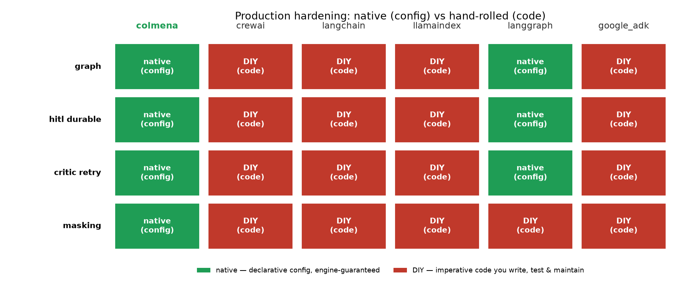
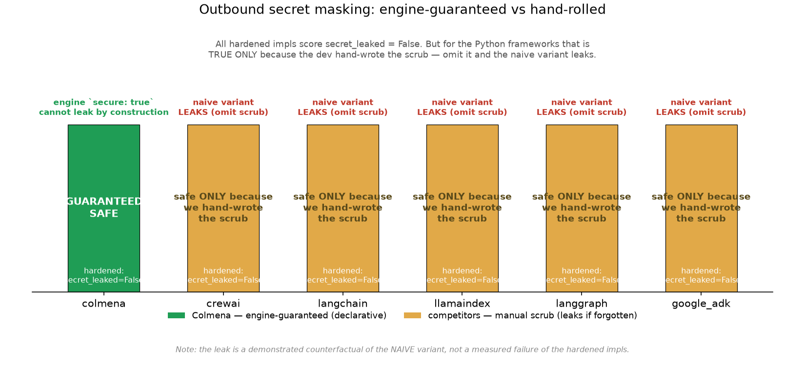
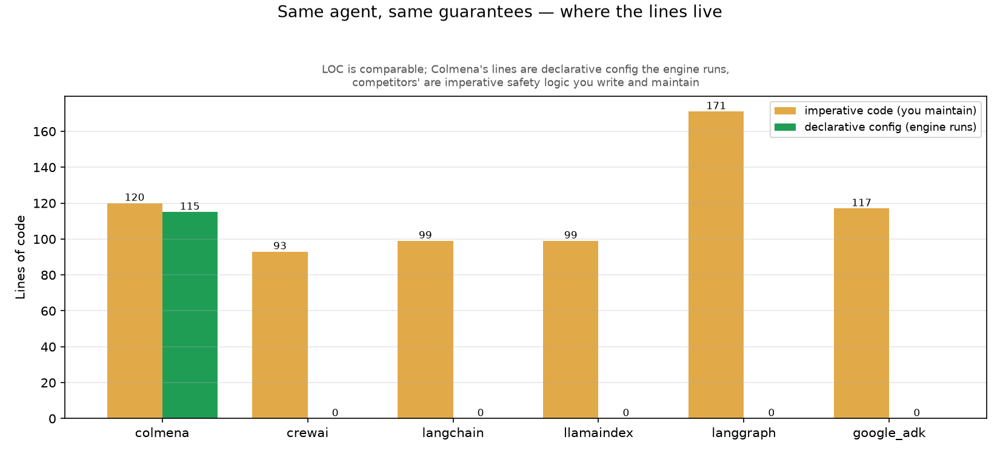

# Production Hardening as Configuration — The Production Refund Agent (guaranteed vs hand-rolled)

**The honest thesis.** The same production-hardened refund agent — durable
cross-process human-in-the-loop (HITL), critic-retry on a policy violation, and
outbound secret masking — was built in **6 frameworks**, and all 6 pass. **Line
count is NOT a Colmena win** (they're comparable — and LangGraph is the *highest*).
The real, defensible win is *how* the hardening is expressed: in Colmena it is
**declarative config the engine guarantees** (`secure: true`, a `suspend` node, a
`router` node, a `cyclic` edge); in the Python frameworks it is **hand-rolled
imperative safety code you must get right** — and a naive version that forgets the
manual scrub **leaks the secret (proven counterfactual).** The hero is *guaranteed
vs fragile-hand-rolled*, evidenced by the masking leak.

**Round-2 finding (the honest narrowing).** LangGraph is the genuine near-peer:
its `StateGraph` is a real graph, `interrupt()` + a file-backed `SqliteSaver`
checkpointer give native durable, cross-process HITL, and the graph loop is its
native critic-retry. So vs the *strongest* competitor the differentiation narrows
to one primitive: **outbound secret masking is the ONLY feature NO Python framework
provides natively — not even LangGraph.** Colmena is the only one where forgetting
to scrub *cannot* leak the secret.

- **Reproduce:** `bash scripts/run_demo06.sh` → `runs/demo06/summary.{json,csv}`,
  then `.venv-bench/bin/python harness/orchestrator/demo06_plots.py` → `runs/demo06/plots/`
- **Replication guide:** [demo06-replication.md](demo06-replication.md)
- **Model:** `gemini-2.5-flash`, temp 0, through the same LiteLLM proxy ·
  masking is **provider-authoritative** (the proxy audits every outbound request
  body for the secret)
- **Scope (round 2):** all 6 frameworks now run — colmena + crewai + langchain +
  llamaindex + **langgraph** + **google_adk**.

---

## 1. What it measures — one agent, six implementations

A customer asks for a **250 USD** refund on a duplicate charge. Policy: a single
agent may auto-approve up to **100 USD**; anything above must be `partial` (≤100)
or `escalate` — never a full `approve` over 100. The agent flow is identical in all
six implementations:

1. **draft** — an LLM proposes `{decision, amount, justification}`.
2. **validate / critic-retry** — a rule check; if the draft auto-approves > 100
   USD it is sent back with feedback and re-drafted (a loop, not a one-shot).
3. **confirm** — an LLM agent calls a **payment tool**. The tool returns the order
   info **plus the gateway `auth_token` (the secret)**. The secret therefore
   genuinely flows through an LLM tool call — this is the masking test.
4. **review (HITL)** — the agent **suspends** for human approval. The process
   stops; a **second, fresh process** resumes it with the human's answer (durable,
   cross-process — not a blocking in-process `input()`).
5. **decide (router)** — the human's free-text answer is classified to
   approve / reject / escalate, and the matching branch logs the outcome.

Everything that could bias the result is shared via `bench_common.scenario_refund`:
the customer message, the policy text, the requested amount, the secret value, and
the payment-tool result shape. Same model, same proxy, temperature 0.

**All six pass** (`runs/demo06/summary.json`): correct `escalate` decision for the
250 USD case, `secret_leaked=false`, HITL suspend/resume across two processes,
critic gate compliant.

---

## 2. Capability matrix — native vs DIY

The centerpiece. For each of the four production capabilities, is the framework
giving it to you **natively** (a node/flag the engine runs), or do you **DIY** it
in imperative handler code?



| Feature | colmena | crewai | langchain | llamaindex | langgraph | google_adk |
|---|---|---|---|---|---|---|
| graph | native | DIY | DIY | DIY | native | DIY |
| hitl_durable | native | DIY | DIY | DIY | native | DIY |
| critic_retry | native | DIY | DIY | DIY | native | DIY |
| masking | native | DIY | DIY | DIY | DIY | DIY |

(Generated by `harness/orchestrator/demo06_matrix.py::render_markdown()`.)

The competitors are capable frameworks — they *can* do all four. The point is not
capability, it's that for each one **you write and maintain the safety logic
yourself**, and the engine does not guarantee it. Colmena expresses all four
declaratively and the engine enforces them.

### The round-2 finding — LangGraph is the honest near-peer

LangGraph stands apart from the other Python frameworks and is the **honest
near-peer**: native graph (`StateGraph`) + durable HITL (`interrupt()` resumed in a
fresh process via a file-backed `SqliteSaver` checkpointer) + graph-loop critic
retry. On three of the four capabilities LangGraph is genuinely native — and we
score it that way. **The differentiation narrows to masking**, the one primitive no
Python framework offers natively. Even LangGraph makes you hand-write the outbound
scrub; only Colmena makes forgetting it unable to leak the secret. That single row
— masking — is the universal, defensible differentiator (see §3).

---

## 3. The masking hero — `secure: true` vs a hand-scrub you can forget

This is the demo's strongest, most defensible claim, because we **proved the
counterfactual both ways.**



**The setup.** In the `confirm` step the payment tool returns the secret
`auth_token`. A tool result re-enters the LLM conversation (and is sent to the
provider on the next turn). So the secret will reach the model — and the proxy —
**unless something masks it.**

**Colmena — one flag, engine-guaranteed.** The payment runs as a `secure: true`
tool inside the `confirm` agent's tool loop
(`runners/colmena/runner/dags/refund_agent.json`):

```json
"pay": {
  "node_type": "python_script",
  "node_schema": {
    "secure": { "type": "boolean", "fixed": true },
    ...
  }
}
```

`get_key` returns the key only as an opaque **handle** (`<sv_...>`); the agent
passes that handle to `pay`; the engine decrypts it **only** to run the python
tool, then the DAG tool executor **re-masks the tool result** (`auth_token` →
`<value_N>`) **before it re-enters the LLM conversation.** The secret genuinely
flows through an LLM yet never reaches the model or the proxy in the clear. **Zero
user code** — `secure: true` is the entire masking implementation.

**Competitors — hand-rolled scrub, repeated, fragile.** No competitor has outbound
tool-result masking. You must wrap every secret-bearing tool and scrub it yourself.
From `runners/crewai/runner/tasks/task06_refund.py`:

```python
result = scenario_refund.payment_lookup(order_id, scenario_refund.SECRET)
# DIY outbound masking — must be repeated for every secret-bearing tool:
result.pop("auth_token", None)
safe = json.dumps(result).replace(scenario_refund.SECRET, "[REDACTED]")
return safe
```

This works — but it is **two lines you have to remember to write for every tool
that touches a secret**, in every handler. Forget them and the secret leaks.

**The proven leak (counterfactual).** A **naive** variant that omits the manual
scrub flips the proxy audit to `secret_leaked=true` for the Python frameworks —
the secret reaches the provider. This holds for **all five** non-Colmena frameworks,
**including LangGraph**: native graph/HITL/retry buys you nothing here, because no
Python framework re-masks an outbound tool result for you. The hardened impls never
leak (`secret_leaked: false` for all six, verified at the proxy in
`proxy/spans/mask-demo06.json`).

**The engine nuance, stated honestly.** Masking in Colmena protects values that
re-enter an LLM **as a `secure: true` tool result** — not values routed by a plain
DAG edge into an `llm_call`'s prompt. We verified that a secure handle wired
straight into a prompt **is decrypted and would leak** (`run_use_case.rs`
re-injects secure handles into every non-`llm` node's inputs, and an `llm_call`
node misses the inject-skip guard). That is exactly why the payment is modeled as a
`secure: true` *tool* inside the confirm agent, not a plain edge. The guarantee is
real and specific; we do not overstate it as "Colmena masks everything everywhere."

---

## 4. HITL + critic-retry — declarative vs hand-rolled

The other two capabilities tell the same story, less dramatically.

| Capability | Colmena (declarative) | Competitors (hand-rolled) |
|---|---|---|
| **Durable cross-process HITL** | a `suspend` node — the engine persists state, stops, and rehydrates in a fresh process on resume | persist state to a `.state` file in phase 1, return; a separate phase-2 process loads it and finishes. **LangGraph is the exception** — `interrupt()` + a file-backed `SqliteSaver` checkpointer is a genuinely native durable cross-process suspend. CrewAI/LangChain/LlamaIndex/ADK hand-roll it; CrewAI's only built-in HITL is a blocking in-process `input()` during `kickoff()` |
| **Critic-retry loop** | a `cyclic` edge `validate.retry → draft.feedback` — the engine loops the draft with feedback until the policy check passes | an explicit `for` loop calling the LLM, a rule check, and feedback re-prompting, with a manual retry counter (LangGraph expresses it as a native graph loop edge) |
| **Router** | a `router` node (`extract_and_route`) that classifies the human answer to a branch | a hand-written keyword/regex classifier mapping free text → approve/reject/escalate (LangGraph: a conditional edge) |

In Colmena these are a few lines of JSON config (`suspend`, `router`, the `cyclic`
edge flag) that the engine executes. In most competitors they are tens of lines of
imperative glue per handler that you write, test, and maintain. **LangGraph reaches
native parity on these three** (graph, durable HITL, critic-retry) — which is why
the honest differentiator is masking (§3), not these.

---

## 5. LOC — honest: comparable, NOT a Colmena win



Stripped line counts (blanks/comments/docstrings excluded), from
`runs/demo06/summary.json`:

| Framework | Code LOC | Config LOC (declarative DAG) |
|---|--:|--:|
| **colmena** | 120 | 115 |
| crewai | 93 | 0 |
| langchain | 99 | 0 |
| llamaindex | 99 | 0 |
| langgraph | 171 | 0 |
| google_adk | 117 | 0 |

**State it plainly: line count is comparable and is NOT a Colmena win.** Colmena's
imperative code (120) is in the same range as the competitors (93–117), and it
*also* carries 115 lines of declarative DAG config. **LangGraph is the *highest* at
171** — building the `StateGraph` + checkpointer wiring is *more* code than the
hand-rolled loops, not less. If anything, by raw lines Colmena does not come out
ahead. The win is *guaranteed-vs-hand-rolled*, evidenced by the masking-leak
counterfactual — not line count.

The difference that matters is not *how many* lines, it's *what kind*: Colmena's
115 lines are **declarative config the engine runs and guarantees** (the same way a
schema or a YAML pipeline isn't application logic) — the safety properties are
enforced by the engine, not by code you can get wrong. The competitors' lines are
**imperative safety logic you author and must maintain correctly**: the scrub, the
retry loop, the state-file persist/rehydrate, the regex router. Get one wrong (e.g.
forget the scrub) and it silently breaks (the secret leaks). That is the whole
pitch — *guaranteed config vs fragile hand-rolled code* — and it is independent of
line count.

---

## 6. Results — all six pass

From `runs/demo06/summary.{json,csv}` (250 USD duplicate-charge case):

| Framework | decision | secret_leaked | hitl_ok | critic_ok | masking_ok | all_ok |
|---|---|:--:|:--:|:--:|:--:|:--:|
| **colmena** | escalate | false | ✓ | ✓ | ✓ | ✓ |
| crewai | escalate | false | ✓ | ✓ | ✓ | ✓ |
| langchain | escalate | false | ✓ | ✓ | ✓ | ✓ |
| llamaindex | escalate | false | ✓ | ✓ | ✓ | ✓ |
| langgraph | escalate | false | ✓ | ✓ | ✓ | ✓ |
| google_adk | escalate | false | ✓ | ✓ | ✓ | ✓ |

All six reach the policy-compliant `escalate` decision (250 > 100), never leak the
secret, suspend and resume across two processes, and pass the critic gate.

---

## 7. Honest framing & limitations

- **LOC is not a win.** Said above and worth repeating: do not pitch line count.
  The win is *declarative-config-the-engine-guarantees* vs *imperative-safety-code-
  you-maintain*, evidenced by the masking leak. (LangGraph is in fact the highest
  at 171 LOC.)
- **LangGraph is the honest near-peer.** It reaches native parity on graph +
  durable cross-process HITL + critic-retry; we score it that way and do not
  cherry-pick. The defensible differentiation vs the strongest competitor narrows
  to **masking** — the one primitive no Python framework provides natively.
- **Masking is coarse / specific.** The engine re-masks **whole `secure: true` tool
  results**, and only those — not arbitrary substrings routed elsewhere (see §3).
  The guarantee is real but scoped; a secure handle wired into a plain prompt edge
  would leak. The demo is built to use masking exactly where it holds.
- **The competitors are good frameworks.** They *can* do all four capabilities —
  the demo's claim is about who guarantees them vs who makes you hand-roll them,
  not about capability.

---

## 8. Files

- Colmena DAG (declarative, `secure: true`): `runners/colmena/runner/dags/refund_agent.json`
- Competitor handlers (hand-rolled hardening):
  `runners/{crewai,langchain,llamaindex,langgraph,google_adk}/runner/tasks/task06_refund.py`
  (LangGraph: native `StateGraph` + `interrupt()` + file-backed `SqliteSaver`)
- Shared scenario assets: `runners/_bench_common/bench_common/scenario_refund.py`
- Capability matrix: `harness/orchestrator/demo06_matrix.py`
- Charts: `harness/orchestrator/demo06_plots.py` → `runs/demo06/plots/`
- Driver: `harness/orchestrator/demo_refund_run.py`, `scripts/run_demo06.sh`
- Results: `runs/demo06/summary.{json,csv}`; masking audit: `proxy/spans/mask-demo06.json`
