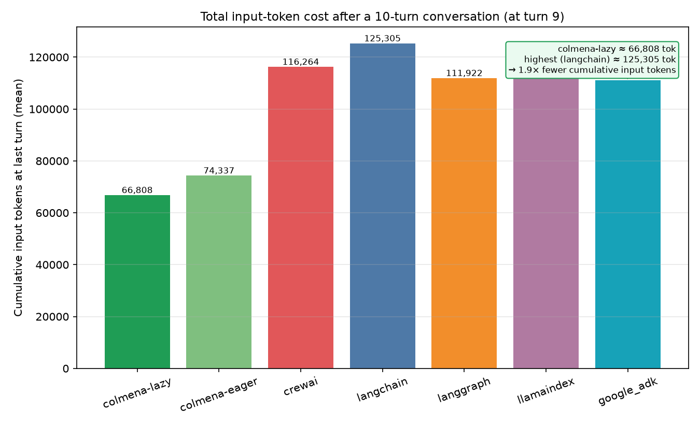
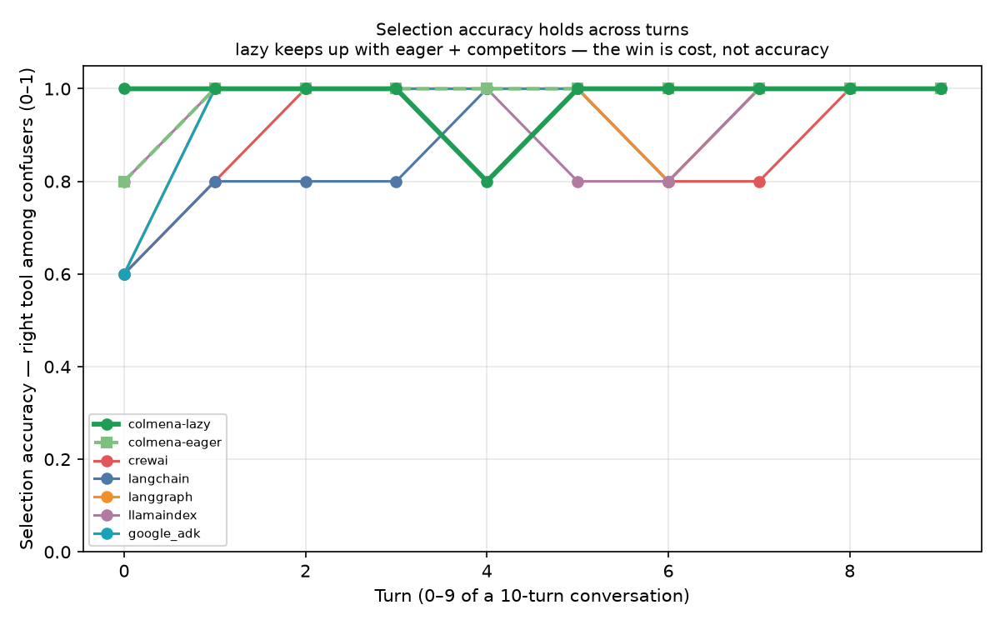

# Demo #7 — Many tools across a conversation (lazy tool loading)

**The honest thesis (v2, multi-turn — the PRIMARY result).** A realistic agent
holds ~30 tools and is used over a *conversation*, not a single shot. Every turn,
the frameworks that put all tool schemas in the prompt **re-send all ~30 schemas
again** — so their input-token cost climbs turn after turn. Colmena's lazy tool
loading sends a compact *catalog* (name + one-line summary) and pulls the one
schema it needs on demand, so its cumulative input-token cost stays much lower and
**the gap widens with every turn**. At ~equal selection accuracy, **lazy keeps
cumulative input tokens lower across the conversation** — the win is *modest at 30
tools (~2–3× cumulative by turn 10 in early data) and grows with both tool count
and turns.* **Lazy is a SCALE/cost feature, not an accuracy claim.**

This framing matches current best practice: **Anthropic recommends a tool-search /
on-demand pattern once an agent carries ≳30 tools**, and keeping only ~5–10 tool
definitions per request rather than stuffing the full catalog into every prompt.
Colmena's `lazy_tool_loading` flag is exactly that pattern, declared once on the
agent node.

- **Reproduce:** [demo07-replication.md](demo07-replication.md). Multi-turn session
  sweep: start the proxy, then
  `PROXY_BENCH_RUN_ID=demo07 .venv-bench/bin/python harness/orchestrator/demo_tools_session_run.py`
  → `runs/demo07/session_summary.{json,csv}`, then
  `.venv-bench/bin/python harness/orchestrator/demo07_session_plots.py`
  → `runs/demo07/plots/session_*.png`.
- **Model:** `gemini-2.5-flash`, temp 0, through the same LiteLLM proxy ·
  tokens are **provider-authoritative** (summed from the proxy spans, never a
  framework self-report).
- **Configs (7):** `colmena-lazy` (lazy ON) and `colmena-eager` (lazy OFF — the
  internal control) on the *same engine*, plus `crewai`, `langchain`, `langgraph`,
  `llamaindex`, `google_adk`.

---

## 1. The v2 multi-turn session — the primary measurement

Each session is **one fixed toolset of ~30 tools** (built from whole confusable
clusters, so every turn's needle has its plausible siblings present) replayed over
a **10-turn conversation**. Each turn the user makes one request that never names a
tool; the agent must read the natural-language intent, pick the right tool among
confusers, and call it with the right args. A given `seed` is **byte-stable**, so
all 7 configs replay the *identical* toolset + per-turn requests — fairness across
configs. We sweep **5 seeds (0–4)** and measure, per config and per turn:

- **`cum_tokens_mean`** — cumulative input tokens through that turn
  (provider-authoritative) · **the hero metric**.
- `selection_acc` — fraction of turns whose needle tool was actually called.

**Per-turn token accounting** uses the runner-emitted `extras.turn_boundaries` (11
ISO timestamps for 10 turns) to bucket proxy spans into turns by wall-clock
(`harness/orchestrator/demo05_buckets.py`). Tool calls are bucketed the same way by
their logged `ts` and scored with `scenario_tools.score_turn`.

### The result — cumulative input tokens grow with the conversation

The hero chart: colmena-lazy (green, bold) stays the lowest, flattest line; the
competitors and colmena-eager climb faster because they re-send every schema each
turn. The gap *widens* with turns — by the last turn it is the punchline bar.

> **Early data (validation slice, seed 0, colmena-lazy vs langchain).** Cumulative
> input tokens at turn 9: **colmena-lazy ≈ 41,740** vs **langchain ≈ 114,724** —
> about **2.75× fewer** cumulative input tokens after a 10-turn conversation at 30
> tools. This is from the 1-seed validation; refresh from
> `runs/demo07/session_summary.json` after the human runs the full 7-config × 5-seed
> sweep.

### Selection accuracy — reported straight

Selection accuracy is plotted per turn; the win is **cost, not accuracy**.

> **Honest caveat from early data.** On the seed-0 validation slice, colmena-lazy's
> per-turn `selection_acc` came in *lower* than langchain's: the lazy
> `describe_tool` → call-the-revealed-tool round-trip did not always complete in the
> multi-turn flow, so several turns logged no terminal tool call. Whether this is a
> seed-0 artifact or a real lazy-flow tradeoff at 30 tools will be settled by the
> full 5-seed sweep — report the accuracy story from the *full* data, not this
> slice. If lazy trails eager/competitors on accuracy, that tradeoff is stated
> plainly here, not hidden.

---

## 2. The mechanism — catalog + `describe_tool`

Colmena's lazy tool loading is a single declarative flag on the agent node:
`"lazy_tool_loading": true` in the DAG (`_build_dag` in
`runners/colmena/runner/tasks/task07b_tools.py` for the session handler, and
`task07_tools.py` for the single-turn handler). With it on, the engine:

1. Puts only a **catalog** (each tool's `name` + one-line `summary`) in the prompt
   — not the full parameter schemas.
2. Exposes a `describe_tool(name)` meta-tool. The model, having chosen a tool from
   the catalog, calls `describe_tool` to fetch *that one* full schema, then calls
   the tool with correct arguments. In the multi-turn session the discovered-tool
   set persists across turns (same `session_id`), so the catalog is paid once, not
   per turn.

So the prompt cost is roughly `N × (a short summary)` instead of
`N × (a full JSON schema)` — **and in a conversation, the competitors re-pay the
full `N × schema` cost every turn while lazy does not.** The describe_tool
round-trip is real and is **counted** in every token total here — lazy still wins
because one schema ≪ N schemas at scale, compounded over turns. The five
competitors have no equivalent toggle; they send every tool's full schema every
call (this is also exactly what `colmena-eager` does, which is why it tracks the
competitors and serves as the internal control).

---

## Appendix A — single-turn sweep (secondary; the original v1 result)

> The sections below are the **single-turn** v1 experiment: one toolset of N tools,
> one request, swept over N = 5 / 10 / 20 (and a 200-tool stress probe). It remains
> a valid demonstration that lazy's per-call token saving grows with the tool
> count; the multi-turn session above is the headline because it reflects how
> agents are actually used (a conversation), where the saving compounds turn over
> turn. Single-turn driver: `harness/orchestrator/demo_tools_run.py`; charts:
> `harness/orchestrator/demo07_plots.py`; data: `runs/demo07/summary.{json,csv}`.

### A.1 What it measures — needle in a haystack

Each cell builds a toolset of **N tools of which exactly one is the needle** (the
tool that actually answers the user's request); the other N-1 are plausible
distractors. The needle's *difficulty* is its parameter count
(`bench_common.scenario_tools._DIFF_RANGE`): **easy** = 1–2 params, **medium** =
3–5, **hard** = 6–10. A given `(n, difficulty, seed)` is **byte-stable**, so all 7
configs see the *identical* toolset and question at a given trial — fairness across
configs. We sweep N over `5, 10, 25, 50, 100, 200` and measure per config:

- `selection_acc` — picked the right tool · `arg_acc` — correct required args ·
  `answer_acc` — final answer correct.
- `tokens_in_mean` — mean input tokens (provider-authoritative).
- `hard_error_rate` — fraction of trials that errored hard (e.g. a provider 4xx
  from oversized tool payloads).

---

### A.2 The result — input tokens at 200 tools (hard)

`runs/demo07/summary.json`, difficulty `hard`, N=200, 2 trials:

| Config | Input tokens (mean) | vs colmena-lazy |
|---|--:|--:|
| **colmena-lazy** (lazy ON) | **22,190** | **1.0×** |
| langgraph | 44,722 | 2.0× |
| langchain | 44,722 | 2.0× |
| google_adk | 44,756 | 2.0× |
| llamaindex | 44,915 | 2.0× |
| colmena-eager (lazy OFF, control) | 55,303 | 2.5× |
| crewai | 103,539 | 4.7× |

The win **grows with N** (same facet, hard): at 5 tools lazy (2,286) ≈ eager
(2,231) ≈ the competitors — no benefit, the catalog is as big as the schemas. By 50
tools lazy (3,784) is already ~3.8× under eager (14,541) and the competitors
(~11.5k–26.8k). By 200 tools the gap is the table above. The hero chart shows
colmena-lazy as the lowest, flattest line at scale:

**colmena-eager is the control that isolates the feature.** It is the same Colmena
engine with lazy OFF; it tracks the competitors (it sends all schemas too). The
delta between colmena-lazy and colmena-eager is the lazy feature's contribution,
holding the engine constant — so the saving is attributable to lazy loading, not to
Colmena being "lighter" in general.

---

### A.3 Accuracy holds — the savings cost nothing (on this model, single-turn)

Across the grid, `answer_acc` stays at **1.0 for every config at every tool count**,
including 200 tools, and `hard_error_rate` is **0.0 everywhere** — gemini-2.5-flash
does not 4xx even when handed all 200 full schemas.

> One artifact in the current small grid: at N=50 hard, `colmena-lazy` shows
> `selection_acc`/`arg_acc` = 0.5 on 2 trials while `answer_acc` stays 1.0. This is
> a 1-of-2 selection-trace blip, not an answer regression; the full sweep's higher
> trial count will smooth it. Report the real accuracy story from the *full* data.

---

## 3. Honest limitations

- **The win is cumulative tokens at scale, not reliability or a single-call
  saving.** At ~30 tools the per-turn saving is **modest** (~2–3× cumulative by the
  end of a 10-turn conversation in early data); it is larger at higher tool counts
  (single-turn 200-tool probe, Appendix A.2). Lazy is a **scale feature**.
- **No benefit at small tool counts.** At ~5 tools the catalog is about the size of
  the schemas, so lazy ≈ eager. The advantage only appears as N (and turns) grow.
- **Lazy pays for its `describe_tool` round-trips.** Those extra calls are real and
  are included in every token total — the win is net of that overhead.
- **Selection accuracy is the thing to watch, not assume.** In the seed-0
  validation, lazy's multi-turn `describe_tool` → call flow did not always complete,
  so its `selection_acc` trailed. This must be confirmed (or ruled out) across all 5
  seeds before claiming "~equal accuracy"; if lazy genuinely trades some selection
  reliability for tokens at 30 tools, that tradeoff is reported plainly.
- **`colmena-eager` is the control**, not a strawman: it proves the saving comes
  from the lazy feature, not from Colmena generally.
- **Single model, temp 0.** Provider-authoritative tokens; a different model could
  behave differently at the schema-volume extremes.
- **Token accounting requires a serial sweep + one proxy.** Colmena's spans are
  attributed by a session-file line-count delta (it does not forward
  `x-bench-run-id`); a parallel sweep or a second proxy would corrupt the delta. See
  [demo07-replication.md](demo07-replication.md).

---

## 4. Files

- Session task YAML: `harness/tasks/07b_tools_session.yaml` (single-turn:
  `harness/tasks/07_tools.yaml`)
- Session generator + per-turn scoring:
  `runners/_bench_common/bench_common/scenario_tools.py`
  (`generate_session`, `score_turn`)
- Colmena session handler (lazy flag + `describe_tool`, one `run_dag` per turn):
  `runners/colmena/runner/tasks/task07b_tools.py`
- Competitor session handlers: `runners/<framework>/runner/tasks/task07b_tools.py`
- Per-turn span bucketing: `harness/orchestrator/demo05_buckets.py`
- Session sweep driver: `harness/orchestrator/demo_tools_session_run.py`
- Session charts: `harness/orchestrator/demo07_session_plots.py`
  → `runs/demo07/plots/session_*.png`
- Session data: `runs/demo07/session_summary.{json,csv}`
- Single-turn (Appendix A) driver/charts/data:
  `harness/orchestrator/demo_tools_run.py`,
  `harness/orchestrator/demo07_plots.py`, `runs/demo07/summary.{json,csv}`
