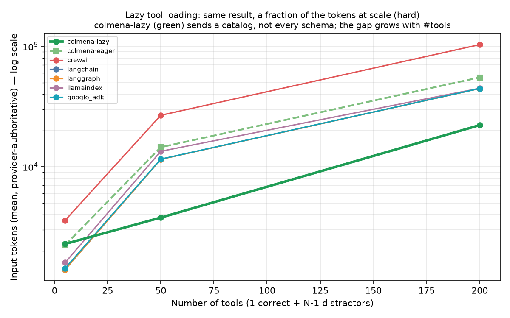
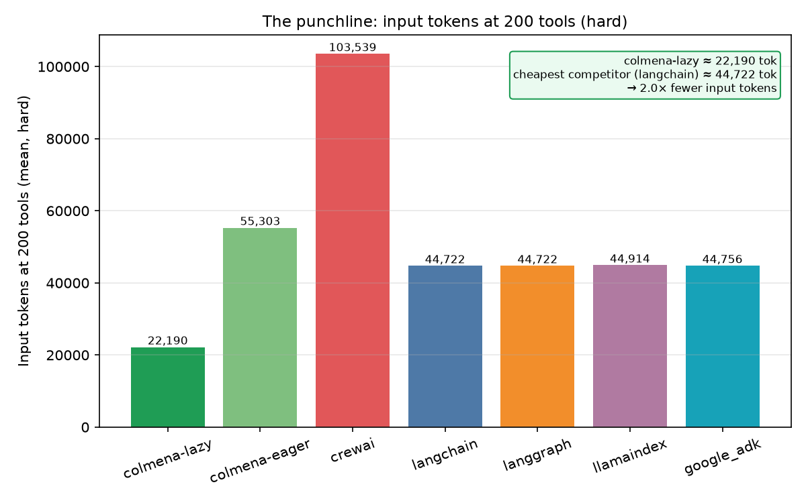
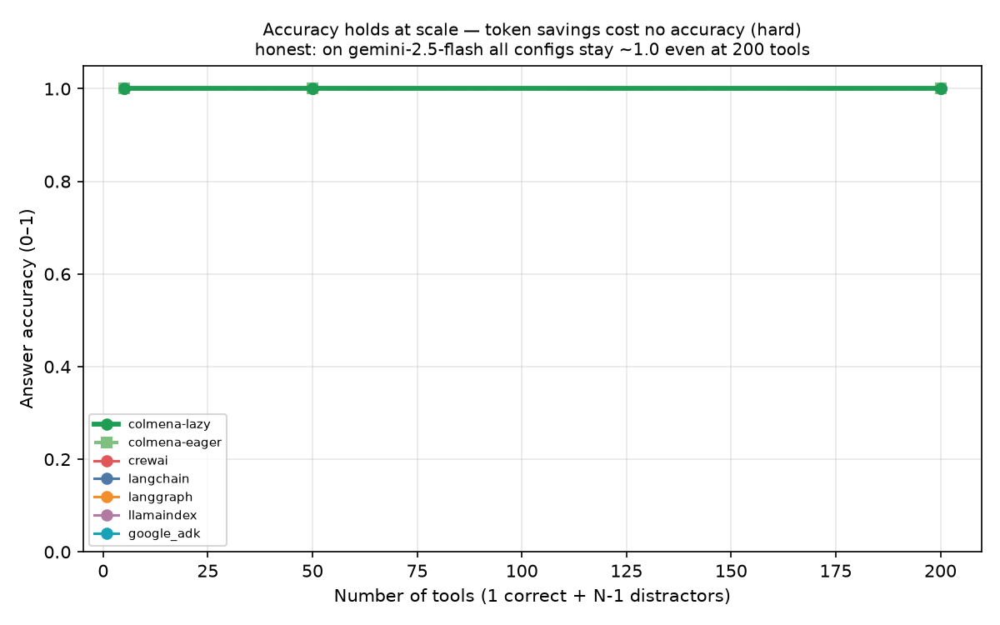

# Demo #7 — Many tools, one needle (lazy tool loading)

**The honest thesis.** When an agent has many tools, **lazy tool loading delivers
the SAME result for a fraction of the input tokens — and the saving grows with the
tool count.** Instead of putting every tool's full JSON schema in the prompt,
Colmena sends the model a compact *catalog* (name + one-line summary) and lets it
pull the one schema it needs on demand via `describe_tool`. At 5 tools this is a
wash (the catalog ≈ the schemas); at 200 tools it is a large, widening gap.

**This is a token win at scale, not a reliability win.** On `gemini-2.5-flash`
there is **no accuracy collapse and no hard-error** — every config, including the
competitors that send all 200 schemas, stays ~100% accurate and gemini does not
4xx at 200 tools. So the defensible claim is *cheaper at scale for the same
answer*, not *competitors fail*.

- **Reproduce:** [demo07-replication.md](demo07-replication.md)
  (`bash scripts/run_demo07.sh` → `runs/demo07/summary.{json,csv}`, then
  `.venv-bench/bin/python harness/orchestrator/demo07_plots.py` → `runs/demo07/plots/`)
- **Model:** `gemini-2.5-flash`, temp 0, through the same LiteLLM proxy ·
  tokens are **provider-authoritative** (summed from the proxy spans, never a
  framework self-report).
- **Configs (7):** `colmena-lazy` (lazy ON) and `colmena-eager` (lazy OFF — the
  internal control) on the *same engine*, plus `crewai`, `langchain`, `langgraph`,
  `llamaindex`, `google_adk`.

> **Data note.** The numbers below come from the run that produced
> `runs/demo07/summary.json` at the time of writing: a **small grid** (difficulty
> `hard`, tool counts 5 / 50 / 200, **2 trials per cell**). The full sweep adds
> tool counts 10 / 25 / 100 and the `easy` / `medium` difficulties. Re-render the
> charts and refresh the table below from `summary.json` after the full sweep
> finishes.

---

## 1. What it measures — needle in a haystack

Each cell builds a toolset of **N tools of which exactly one is the needle** (the
tool that actually answers the user's request); the other N-1 are plausible
distractors. The needle's *difficulty* is its parameter count
(`bench_common.scenario_tools._DIFF_RANGE`): **easy** = 1–2 params, **medium** =
3–5, **hard** = 6–10. A given `(n, difficulty, seed)` is **byte-stable**, so all 7
configs see the *identical* toolset and question at a given trial — fairness across
configs. We sweep N over `5, 10, 25, 50, 100, 200` and measure per config:

- `selection_acc` — picked the right tool · `arg_acc` — correct required args ·
  `answer_acc` — final answer correct.
- `tokens_in_mean` — mean input tokens (provider-authoritative).
- `hard_error_rate` — fraction of trials that errored hard (e.g. a provider 4xx
  from oversized tool payloads).

---

## 2. The mechanism — catalog + `describe_tool`

Colmena's lazy tool loading is a single declarative flag on the agent node:
`"lazy_tool_loading": true` in the DAG (`runners/colmena/runner/tasks/task07_tools.py`,
`_build_dag`). With it on, the engine:

1. Puts only a **catalog** (each tool's `name` + one-line `summary`) in the prompt
   — not the full parameter schemas.
2. Exposes a `describe_tool(name)` meta-tool. The model, having chosen a tool from
   the catalog, calls `describe_tool` to fetch *that one* full schema, then calls
   the tool with correct arguments.

So the prompt cost is roughly `N × (a short summary)` instead of
`N × (a full JSON schema)`. The describe_tool round-trip is real and is **counted**
in the token totals below — lazy still wins because one schema ≪ N schemas at
scale. The five competitors have no equivalent toggle; they send every tool's full
schema every call (this is also exactly what `colmena-eager` does, which is why it
sits with the competitors).

---

## 3. The result — input tokens at 200 tools (hard)

`runs/demo07/summary.json`, difficulty `hard`, N=200, 2 trials:

| Config | Input tokens (mean) | vs colmena-lazy |
|---|--:|--:|
| **colmena-lazy** (lazy ON) | **22,190** | **1.0×** |
| langgraph | 44,722 | 2.0× |
| langchain | 44,722 | 2.0× |
| google_adk | 44,756 | 2.0× |
| llamaindex | 44,915 | 2.0× |
| colmena-eager (lazy OFF, control) | 55,303 | 2.5× |
| crewai | 103,539 | 4.7× |

The win **grows with N** (same facet, hard): at 5 tools lazy (2,286) ≈ eager
(2,231) ≈ the competitors — no benefit, the catalog is as big as the schemas. By 50
tools lazy (3,784) is already ~3.8× under eager (14,541) and the competitors
(~11.5k–26.8k). By 200 tools the gap is the table above. The hero chart shows
colmena-lazy as the lowest, flattest line at scale:

**colmena-eager is the control that isolates the feature.** It is the same Colmena
engine with lazy OFF; it tracks the competitors (it sends all schemas too). The
delta between colmena-lazy and colmena-eager is the lazy feature's contribution,
holding the engine constant — so the saving is attributable to lazy loading, not to
Colmena being "lighter" in general.

---

## 4. Accuracy holds — the savings cost nothing (on this model)

Across the grid, `answer_acc` stays at **1.0 for every config at every tool count**,
including 200 tools, and `hard_error_rate` is **0.0 everywhere** — gemini-2.5-flash
does not 4xx even when handed all 200 full schemas.

> One artifact in the current small grid: at N=50 hard, `colmena-lazy` shows
> `selection_acc`/`arg_acc` = 0.5 on 2 trials while `answer_acc` stays 1.0. This is
> a 1-of-2 selection-trace blip, not an answer regression; the full sweep's higher
> trial count will smooth it. Report the real accuracy story from the *full* data.

---

## 5. Honest limitations

- **The win is tokens, not reliability — on this model.** No accuracy collapse and
  no hard-error were observed on gemini-2.5-flash even at 200 tools, so we do *not*
  claim competitors fail. If the full grid (with easy/medium) surfaces a
  difficulty-dependent accuracy drop, that will be reported honestly; absent that,
  accuracy is a **tie** and lazy's value is purely the token reduction.
- **No benefit at small tool counts.** At ~5 tools the catalog is about the size of
  the schemas, so lazy ≈ eager. The advantage only appears as N grows.
- **Lazy pays for its `describe_tool` round-trips.** Those extra calls are real and
  are included in `tokens_in_mean` — the win is net of that overhead.
- **`colmena-eager` is the control**, not a strawman: it proves the saving comes
  from the lazy feature, not from Colmena generally.
- **Single model, temp 0.** Provider-authoritative tokens; a different model could
  behave differently at the schema-volume extremes (where reliability, not just
  tokens, might start to matter).

---

## 6. Files

- Task YAML: `harness/tasks/07_tools.yaml`
- Toolset generator + scoring: `runners/_bench_common/bench_common/scenario_tools.py`
- Colmena handler (lazy flag + `describe_tool`): `runners/colmena/runner/tasks/task07_tools.py`
- Competitor handlers: `runners/<framework>/runner/tasks/task07_tools.py`
- Sweep driver: `harness/orchestrator/demo_tools_run.py`
- Charts: `harness/orchestrator/demo07_plots.py` → `runs/demo07/plots/`
- Summary data: `runs/demo07/summary.{json,csv}`
