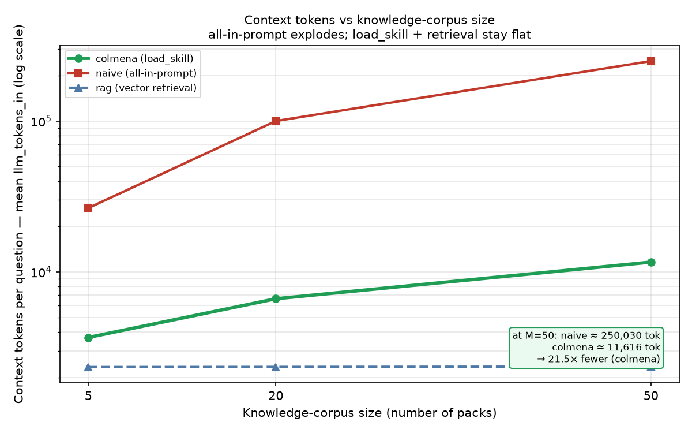

# Progressive Knowledge Loading (Skills)

**Hypothesis:** as a body of domain knowledge grows, Colmena's native `load_skill`
loads only the relevant pack on demand — holding context tokens far below dumping
everything in the prompt, and getting RAG-grade efficiency **without** a vector store
or embeddings pipeline.

**Scenario — "Colmena Seguros" policy QA.** A fictional insurer's knowledge base is a
library of **policy packs** (product lines), each a nested tree: perils → sub-conditions
→ a leaf holding **company-specific, non-guessable values** (deductibles, coverage
limits). A customer question is answerable by exactly one value buried in one leaf of the
right pack. The answer is graded by **exact value match** (extractive QA): every expected
value is **unique across the whole 50-pack corpus**, so retrieving the wrong leaf yields
a wrong number — the values are arbitrary 4–6 digit amounts no model can guess.

**Three arms**, swept over a corpus of **5 / 20 / 50 packs**, 18 questions × 3 seeds:
- **colmena** — one `llm_call` with `skills_path`; the model calls `load_skill(pack)` →
  `load_skill(pack, "peril/sub")` to navigate the tree (the hero).
- **naive** — concatenate every pack's full markdown into the system prompt (5 frameworks).
- **rag** — embed all pack files, retrieve top-4 chunks per question (LlamaIndex + LangChain).

Provider-authoritative completion tokens from the LiteLLM proxy; **1296 cells, 7 errors
(0.5%)**. 50-pack corpus ≈ 225k tokens.

---

## Result 1 — the token win (the headline). `tokens_vs_packs.png`

Mean context (input) tokens per question:

| packs | colmena | naive | rag |
|------:|--------:|------:|----:|
| 5  | 3,676 | 26,519 | 2,340 |
| 20 | 6,637 | 100,090 | 2,345 |
| 50 | **11,616** | **250,030** | 2,357 |

At **50 packs, Colmena uses 21.5× fewer context tokens than prompt-stuffing**
(11,616 vs 250,030). Naive grows **linearly** with the corpus; Colmena grows
**sub-linearly** (it pays only a *catalog tax* — the name+description of each pack — then
loads bodies on demand). In dollars (gemini-2.5-flash): **$4.23 vs $75.76 per 1,000
questions at M=50 (~18× cheaper).** `cost_at_50_bar.png`.

---

## Result 2 — accuracy did NOT separate the arms (honest finding). `accuracy_vs_packs.png`

| packs | colmena | naive | rag |
|------:|--------:|------:|----:|
| 5  | 100% | 100% | 96.8%\* |
| 20 | 100% | 100% | 100% |
| 50 | 100% | 100% | 100% |

We expected naive to degrade (lost-in-the-middle) and RAG to mis-retrieve at scale.
**Neither happened at this scale/model.** gemini-2.5-flash's 1M-token window found the
needle even inside a 250k-token naive prompt, and RAG retrieved the correct leaf 100% of
the time at 20/50 packs (`retrieval_vs_navigation.png`). **So the Progressive Knowledge Loading win is cost /
token-efficiency, NOT accuracy.** We do not claim an accuracy or miss-rate advantage the
data doesn't show.

\* The M=5 point is mildly confounded: with `pack_count=5 < 6` core packs, one targeted
policy (`colmena-mascotas`) is absent from the corpus, so its 3 questions are
structurally unanswerable (colmena skill-load 85% and RAG hit 83% at M=5 reflect this).
M=20 and M=50 contain all 6 core packs and are clean.

---

## Result 3 — Colmena vs RAG: comparable metrics, simpler infrastructure (honest)

**RAG is the steelman here, and it does very well.** On completion tokens RAG is actually
*lower* than Colmena (≈2,350 flat, no catalog tax) and matches accuracy (100%). **We do
not claim Colmena beats RAG on tokens or accuracy — it doesn't.** Colmena's advantages
over RAG are **infrastructural**, not metric:

| | colmena `load_skill` | naive prompt-stuff | RAG |
|---|---|---|---|
| Native / declarative | ✓ one field (`skills_path`) | n/a | ✗ wire a retriever |
| Vector DB / embeddings pipeline | **none** | none | **required** |
| Tree navigation (overview→peril→sub) | ✓ | ✗ | ✗ (flat similarity) |
| Context tokens scale with corpus | sub-linear | **linear** | flat |
| Separate service to run/tune | none | none | embeddings + index |

`capability_matrix.png`. The honest pitch: **`load_skill` delivers RAG-grade token
efficiency (21× under prompt-stuffing) from a single declarative config field, with no
embeddings model, no vector store, and no retrieval service to operate** — plus
structured tree navigation that flat similarity retrieval has no notion of.

A note on RAG's hidden cost: the completion-token view omits embedding cost. Our harness
re-embeds the corpus per query (an artifact of the benchmark, not how you'd deploy), so
the raw embed figures (≈226k est. tokens/question at M=50) overstate steady-state RAG
cost — a production RAG caches the index. We therefore do **not** lean on embed cost as a
Colmena advantage; the fair statement is "Colmena avoids the embeddings *infrastructure*,"
not "Colmena is cheaper than a cached RAG on embeddings."

---

## Honesty caveats
- **Win is cost, not accuracy.** All arms ≈100% at 20/50 packs; the differentiator is the
  21× token/cost gap vs prompt-stuffing.
- **vs RAG:** comparable accuracy, RAG slightly lower on completion tokens; Colmena's edge
  is zero retrieval infrastructure + declarative config + tree navigation, not the metrics.
- **7 errors (0.5%)**: all `langchain` rag@50 cells — OpenAI embeddings **429 rate-limit**
  (LangChain re-embeds the full 50-pack corpus direct-to-OpenAI each call). Excluded from
  metrics; not scored as wrong.
- **Embeddings** run **direct-to-OpenAI** (the LiteLLM proxy `/embeddings` route requires
  a DB — a litellm limitation), so embed tokens are **estimated** (corpus chars ÷ 4);
  completion tokens remain proxy-authoritative.
- **M=5** has only 5 of 6 core packs (see Result 2 footnote).

## Reproduce
See [demo09-replication.md](demo09-replication.md). One command:
`bash scripts/run_demo09.sh --seeds 3 --yes` (serial; ~4h; ~$35 on gemini-2.5-flash).
