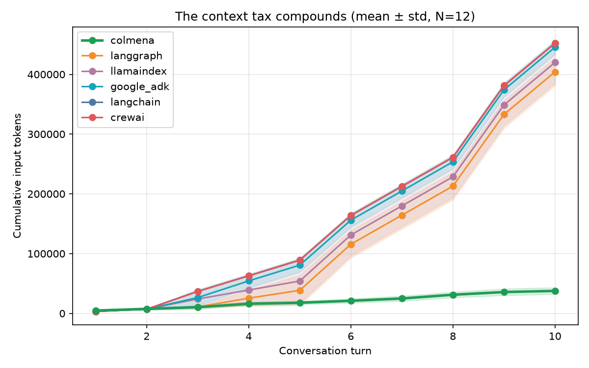
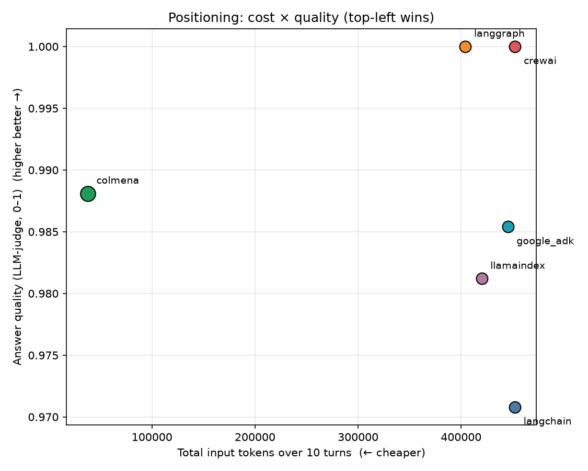
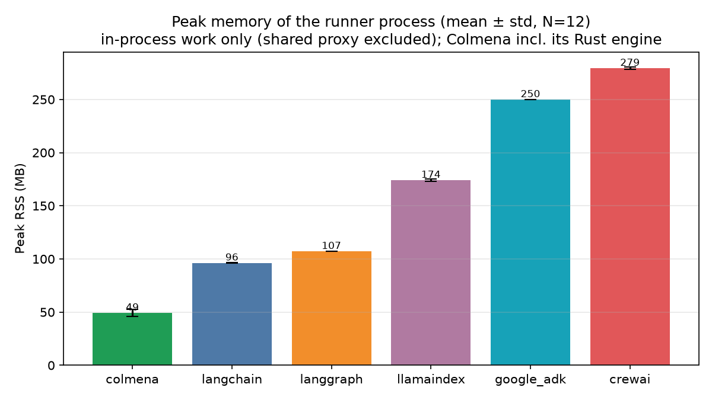
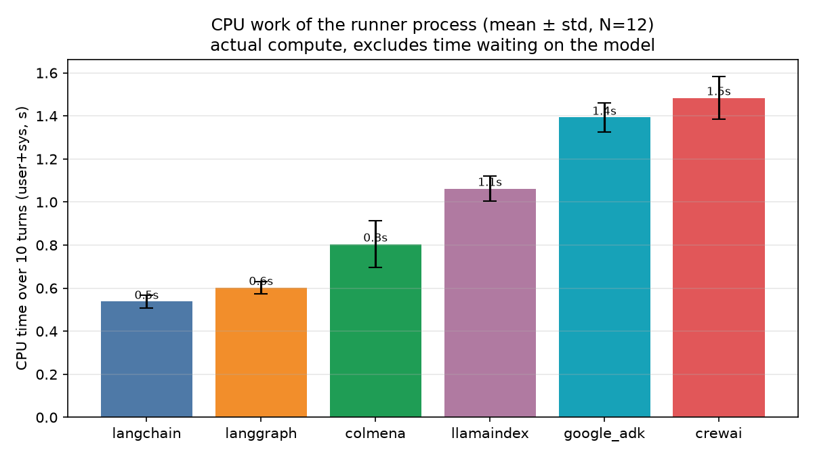
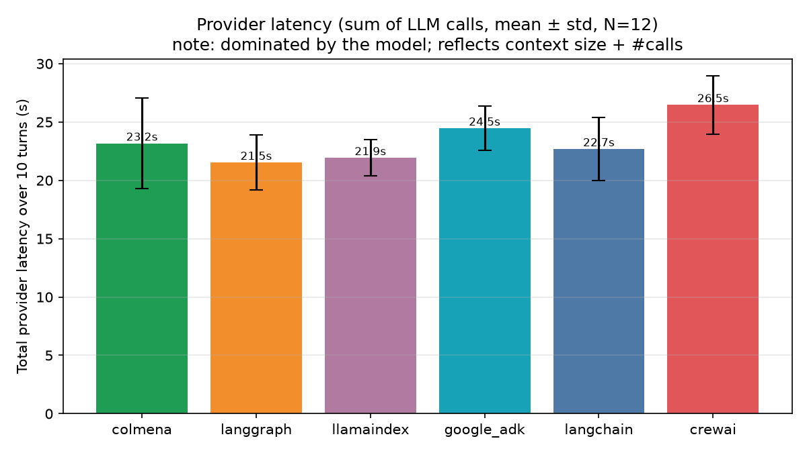
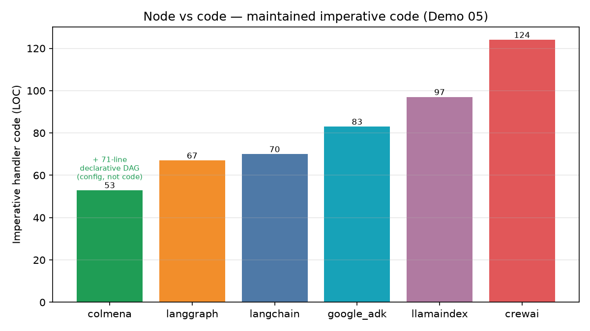
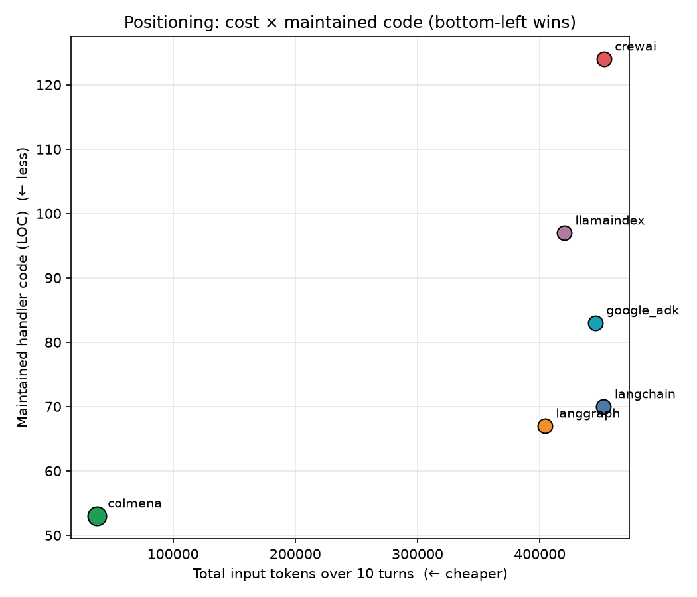
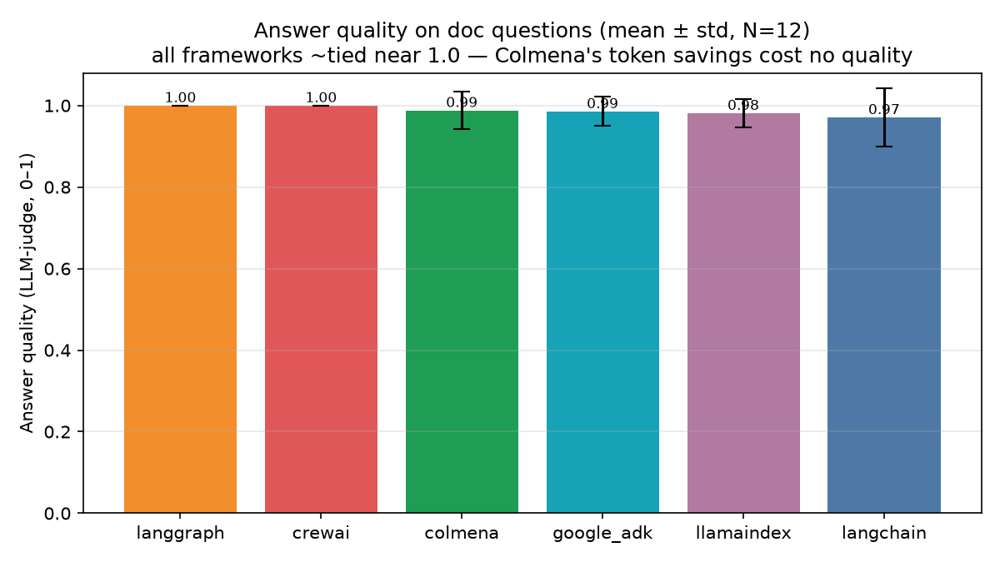
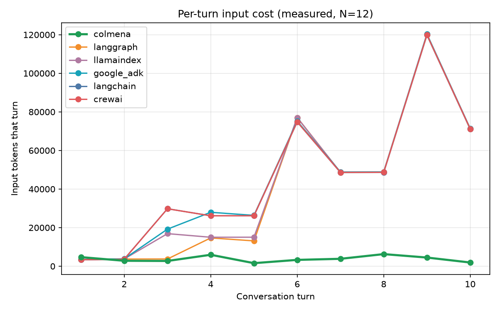
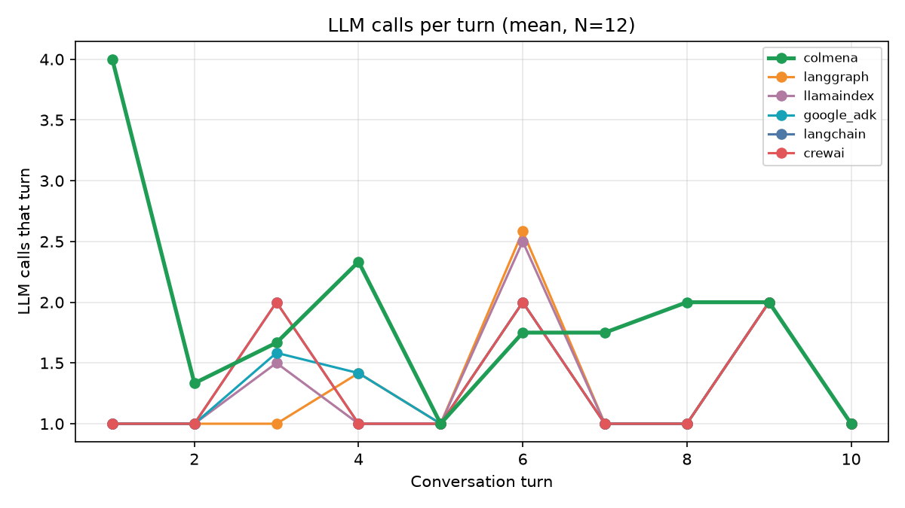

# Demo 05 — "The Context Tax" · Chart Gallery (N=12)

Fixed 10-turn report-assistant conversation, 6 frameworks, `gemini-2.5-flash`,
provider-authoritative tokens (proxy), mean ± std over 12 runs.

**Headline:** Colmena **37,619 ± 5,603** total input tokens vs competitors **404k–452k**
→ **~12×** fewer tokens · **~37×** at turn 10 · **~7.6×** cheaper · **RAM 49 MB** (lowest)
· **quality 0.99** (tied) · **53 LOC** maintained (agent = 71-line declarative DAG).

> Data: `agg_n12.json`, `agg_n12_summary.csv`. Reproduce: see
> [`../../../docs/demos/demo05-replication.md`](../../../docs/demos/demo05-replication.md).

---

## ★ Recommended pitch set (5 charts, in order)

A tight, non-redundant sequence — the rest below are backup/detail.

1. **`2_line_cumulative`** — *"Watch what a normal multi-turn agent costs."* The
   asymptote: Colmena flat, everyone else climbing. The single most convincing slide.
2. **`14_quadrant_cost_quality`** — *"And it's not a quality tradeoff."* Colmena alone
   in the cheap + high-quality corner (LLM-judged 0.99, tied).
3. **`4_bar_usd`** — *"In money, at scale."* USD/conversation + the $/year projection.
4. **`11_bar_ram`** — *"And it's lighter."* Rust footprint: 49 MB vs 96–279.
5. **`5_multiplier_curve`** — *"And it compounds — the longer the chat, the bigger the gap."*

Honesty slide to keep handy: CPU is mid-pack and wall-clock isn't featured (bench
artifact) — leading with these makes the strong claims land. See
[`../../../docs/SELLING_COLMENA.md`](../../../docs/SELLING_COLMENA.md).

---

## Headliners (the pitch)

### Cumulative input tokens per turn — the asymptote
Colmena stays flat; the five competitors climb with every turn.

### Total input tokens (mean ± std)

### Cost × quality — Colmena is cheap AND high-quality
Top-left wins: Colmena alone in the cheap + high-quality corner.

### Cost in USD + at-scale projection

### The advantage compounds with conversation length

---

## Resources

### Peak RAM — Colmena lowest (Rust)

### CPU seconds — honest: Colmena mid-pack

### Total provider latency

---

## Node vs code & quality

### Maintained imperative code (LOC) — agent itself is a declarative DAG

### Cost × maintained code

### Answer quality (LLM-judge, 0–1) — all tied near 1.0
Colmena's token savings cost no measurable quality.

---

## Detail / explanatory

### Per-turn input cost

### LLM calls per turn (Colmena's extra load_attachment round-trips)

### Where the tokens go (estimated composition)

